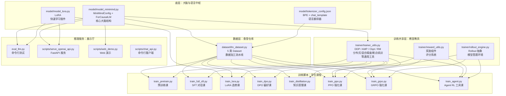
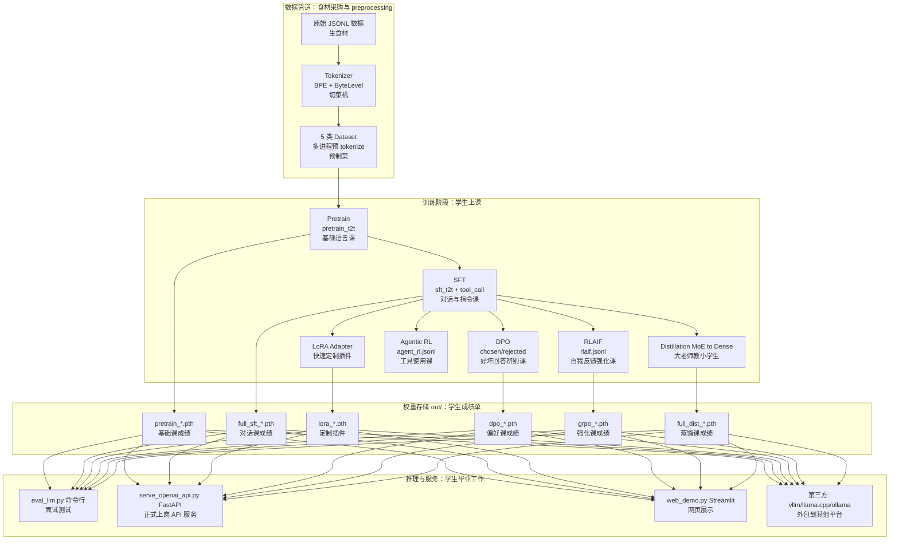

# 02 - 项目架构与目录结构

## 2.1 顶层目录速览

想象这个项目是一栋正在建造的「AI 智能大楼」，每个文件夹都是大楼里的一个功能区域：

```
minimind3/
├── model/                     # 🧠 大脑中心（模型的思考器官）
│   ├── model_minimind.py      #   核心大脑结构：Config + Dense/MoE Transformer
│   ├── model_lora.py          #   大脑的"快速学习插件"（LoRA 微调模块）
│   ├── tokenizer_config.json  #   语言翻译器配置（把人类语言翻译成机器能懂的 token）
│   └── __init__.py
│
├── dataset/                   # 📦 食堂仓库（数据的来源和加工厂）
│   ├── lm_dataset.py          #   5 种不同菜系的 Dataset + 聊天预处理/后处理
│   └── dataset.md             #   食堂菜单说明（JSONL 格式约定）
│
├── trainer/                   # 🎓 教室实验室（训练模型的地方）
│   ├── train_pretrain.py      #   预训练课：让模型先学会基础语言能力
│   ├── train_full_sft.py      #   全量 SFT 课：教模型如何对话和遵循指令
│   ├── train_lora.py          #   LoRA 选修课：用小数据快速定制模型
│   ├── train_dpo.py           #   DPO 偏好课：教模型什么是好回答、什么是坏回答
│   ├── train_distillation.py  #   知识蒸馏课：大老师教小学生的浓缩课程
│   ├── train_ppo.py           #   PPO 强化课：通过奖励机制优化模型行为
│   ├── train_grpo.py          #   GRPO / CISPO 强化课：另一种强化学习方法
│   ├── train_agent.py         #   多轮工具调用课：教模型如何使用外部工具
│   ├── train_tokenizer.py     #   分词器训练课：训练语言翻译器
│   ├── trainer_utils.py       #   共享教具：分布式训练 / 混合精度 / 断点续训 / 采样器 / 奖励模型
│   ├── reward_utils.py        #   评分工具：重复惩罚 / 思考质量评分
│   └── rollout_engine.py      #   可插拔推理引擎：Torch / SGLang（模型考试时的答题环境）
│
├── scripts/                   # 🔌 展示厅与服务台（对外提供服务的窗口）
│   ├── serve_openai_api.py    #   OpenAI 兼容 FastAPI 服务（标准 API 接口）
│   ├── chat_api.py            #   命令行聊天客户端（终端里的对话机器人）
│   ├── web_demo.py            #   Streamlit Web 演示页面（网页版聊天界面）
│   ├── eval_toolcall.py       #   工具调用能力评测（测试模型会不会用工具）
│   └── convert_model.py       #   权重格式转换 / LoRA 合并（模型打包工具）
│
├── tests/                     # 🧪 质检实验室（测试代码是否正确）
│   └── test_trainer_utils.py
│
├── docs/                      # 📚 建筑图纸与技术手册（本技术 Wiki）
├── eval_llm.py                # 命令行推理与多轮对话入口（快速测试模型的门）
├── requirements.txt           # 建筑材料清单（PyTorch 2.6 + Transformers 4.57 等依赖）
├── README.md / README_en.md   # 项目介绍海报（中英文主页文档）
└── LICENSE                    # 开源许可证（Apache 2.0）
```

## 2.2 模块依赖关系

用生活化的方式理解：**训练脚本就像学生，它们都需要去食堂(dataset)吃饭、在教室(trainer_utils)上课、用大脑(model)思考**。



**依赖关系解读**：
- **大脑(model)** 是核心，所有训练和推理都依赖它
- **食堂(dataset)** 为所有训练课程提供数据燃料
- **教室教具(trainer_utils)** 是所有训练脚本的共享工具箱
- **奖励系统(reward_utils)** 和 **答题环境(rollout_engine)** 只为强化学习课程(PPO/GRPO/Agent)服务
- **LoRA 插件** 只被 LoRA 训练课和后续的推理服务使用

## 2.3 训练-推理全景数据流

可以把整个流程想象成 **「培养一个 AI 学生的完整生命周期」**：



**流程解读**：
1. **数据管道**：原始数据像生食材，经过 Tokenizer（切菜机）处理后变成预制菜（Dataset），方便后续快速使用
2. **训练阶段**：模型像学生一样，先上基础课(Pretrain)，再上对话课(SFT)，最后根据需求选修各种高级课程(LoRA/DPO/RL等)
3. **权重存储**：每门课结束后都会保存成绩单（权重文件），可以随时拿出来使用
4. **推理服务**：毕业后的模型可以参加面试测试(eval_llm)、正式上岗(API 服务)、网页展示或外包到其他平台

## 2.4 训练阶段串联关系

训练过程就像 **「打地基→建结构→装修→精装」** 的建筑施工流程：

| 阶段 | 默认 `from_weight` | 默认 `save_weight` | 数据 | 类比说明 |
|------|-------------------|-------------------|------|---------|
| Pretrain | `none`（从随机初始化） | `pretrain` | `pretrain_t2t_mini.jsonl` | **打地基**：从零开始，让模型学会基础语言能力 |
| Full SFT | `pretrain` | `full_sft` | `sft_t2t_mini.jsonl` | **建主体结构**：在基础上教模型如何对话和遵循指令 |
| LoRA | `full_sft` | `lora_*`（独立保存） | `lora_*.jsonl` | **快速装修**：用小数据快速定制，不改动主体结构 |
| DPO | `full_sft` | `dpo` | `dpo.jsonl` | **偏好优化**：教模型分辨好坏回答，提升回答质量 |
| Distillation | `full_sft`（学生）+ `full_sft_moe`（教师） | `full_dist` | `sft_t2t_mini.jsonl` | **浓缩精华**：大老师(MoE)把知识传授给小学生(Dense) |
| PPO/GRPO | `full_sft` | `ppo_actor` / `grpo` | `rlaif.jsonl` | **强化训练**：通过奖励机制让模型表现更好 |
| Agent RL | `full_sft` | `agent_rl` | `agent_rl.jsonl` | **技能培训**：教模型如何使用外部工具完成任务 |

> 💡 **工程要点**：所有训练脚本通过 `--from_weight` 参数指定起点权重（从哪个阶段继续），`--save_weight` 指定保存前缀（保存到哪个阶段）。权重文件名约定：`{save_weight}_{hidden_size}{_moe}.pth`。

## 2.5 设备适配策略

`trainer_utils.py` 中的 `get_default_device()` 会按优先级 `cuda > mps > cpu` 自动选择设备，就像 **「根据厨房条件选择烹饪方式」**：

| 设备 | Flash Attn | AMP | DataLoader workers | 数据存放 | 类比说明 |
|------|-----------|-----|-------------------|---------|---------|
| CUDA | ✅ 启用 | ✅ bf16/fp16 + GradScaler | 多进程 + pin_memory | CPU pinned | **专业厨房**：设备齐全，可以高效并行处理 |
| MPS | ❌ 强制关闭（SDPA on MPS 极慢） | ❌ 禁用（fp32 native 最快） | 0（数据已在 GPU） | GPU 零拷贝 | **家用厨房**：设备有限，直接用原生方式反而更快 |
| CPU | 不适用 | 关闭 | 默认 | CPU | **野外露营**：条件简陋，只能用最基础的方式 |

具体实现见 `trainer/train_pretrain.py` 中第 200~240 行的设备分支与 [14 - 训练工具链](./14-trainer-utils.md)。

## 2.6 后续阅读

- 想理解 `MiniMindForCausalLM` 的每一层实现（大脑的神经元是如何工作的） → [03 - 模型架构](./03-model-architecture.md)
- 想理解数据是如何变成 input_ids 的（食材是如何被加工成预制菜的） → [05 - 数据管道](./05-dataset-pipeline.md)
- 想理解断点续训和 DDP 是如何统一的（教室的教具是如何管理的） → [14 - 训练工具链](./14-trainer-utils.md)
