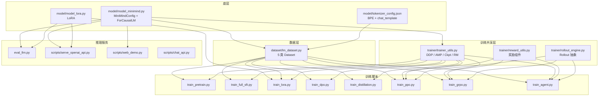
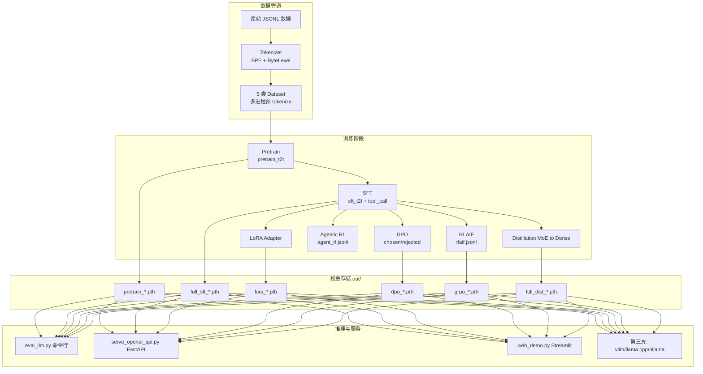

# 02 - 项目架构与目录结构

## 2.1 顶层目录速览

```
minimind3/
├── model/                     # 🧠 模型层
│   ├── model_minimind.py      #   核心模型: Config + Dense/MoE Transformer
│   ├── model_lora.py          #   LoRA 注入/保存/加载/合并
│   ├── tokenizer_config.json  #   分词器配置（含 chat_template Jinja）
│   └── __init__.py
│
├── dataset/                   # 📦 数据层
│   ├── lm_dataset.py          #   5 类 Dataset + chat 预/后处理
│   └── dataset.md             #   数据集说明（JSONL 格式约定）
│
├── trainer/                   # 🎓 训练层
│   ├── train_pretrain.py      #   预训练
│   ├── train_full_sft.py      #   全量 SFT
│   ├── train_lora.py          #   LoRA 微调
│   ├── train_dpo.py           #   DPO 偏好对齐
│   ├── train_distillation.py  #   知识蒸馏
│   ├── train_ppo.py           #   PPO 强化学习
│   ├── train_grpo.py          #   GRPO / CISPO 强化学习
│   ├── train_agent.py         #   多轮 Tool Use Agentic RL
│   ├── train_tokenizer.py     #   BPE 分词器训练
│   ├── trainer_utils.py       #   共享: DDP / AMP / Ckpt / Sampler / RM
│   ├── reward_utils.py        #   RL 奖励工具: 重复惩罚 / 思考评分
│   └── rollout_engine.py      #   可插拔推理引擎: Torch / SGLang
│
├── scripts/                   # 🔌 推理与服务
│   ├── serve_openai_api.py    #   OpenAI 兼容 FastAPI 服务
│   ├── chat_api.py            #   命令行 OpenAI Client
│   ├── web_demo.py            #   Streamlit Web Demo
│   ├── eval_toolcall.py       #   工具调用评测
│   └── convert_model.py       #   权重格式转换 / LoRA 合并
│
├── tests/                     # 🧪 测试
│   └── test_trainer_utils.py
│
├── docs/                      # 📚 本技术 Wiki
├── eval_llm.py                # 命令行推理与多轮对话入口
├── requirements.txt           # PyTorch 2.6 + Transformers 4.57 等
├── README.md / README_en.md   # 项目主页文档
└── LICENSE                    # Apache 2.0
```

## 2.2 模块依赖关系



## 2.3 训练-推理全景数据流



## 2.4 训练阶段串联关系

| 阶段 | 默认 `from_weight` | 默认 `save_weight` | 数据 |
|------|-------------------|-------------------|------|
| Pretrain | `none`（从随机初始化） | `pretrain` | `pretrain_t2t_mini.jsonl` |
| Full SFT | `pretrain` | `full_sft` | `sft_t2t_mini.jsonl` |
| LoRA | `full_sft` | `lora_*`（独立保存） | `lora_*.jsonl` |
| DPO | `full_sft` | `dpo` | `dpo.jsonl` |
| Distillation | `full_sft`（学生）+ `full_sft_moe`（教师） | `full_dist` | `sft_t2t_mini.jsonl` |
| PPO/GRPO | `full_sft` | `ppo_actor` / `grpo` | `rlaif.jsonl` |
| Agent RL | `full_sft` | `agent_rl` | `agent_rl.jsonl` |

> 💡 **工程要点**：所有训练脚本通过 `--from_weight` 参数指定起点权重，`--save_weight` 指定保存前缀。权重文件名约定：`{save_weight}_{hidden_size}{_moe}.pth`。

## 2.5 设备适配策略

`trainer_utils.py` 中的 `get_default_device()` 会按优先级 `cuda > mps > cpu` 自动选择，并针对不同设备做以下差异化处理：

| 设备 | Flash Attn | AMP | DataLoader workers | 数据存放 |
|------|-----------|-----|-------------------|---------|
| CUDA | ✅ 启用 | ✅ bf16/fp16 + GradScaler | 多进程 + pin_memory | CPU pinned |
| MPS | ❌ 强制关闭（SDPA on MPS 极慢） | ❌ 禁用（fp32 native 最快） | 0（数据已在 GPU） | GPU 零拷贝 |
| CPU | 不适用 | 关闭 | 默认 | CPU |

具体实现见 `trainer/train_pretrain.py` 中第 200~240 行的设备分支与 [14 - 训练工具链](./14-trainer-utils.md)。

## 2.6 后续阅读

- 想理解 `MiniMindForCausalLM` 的每一层实现 → [03 - 模型架构](./03-model-architecture.md)
- 想理解数据是如何变成 input_ids 的 → [05 - 数据管道](./05-dataset-pipeline.md)
- 想理解断点续训和 DDP 是如何统一的 → [14 - 训练工具链](./14-trainer-utils.md)
