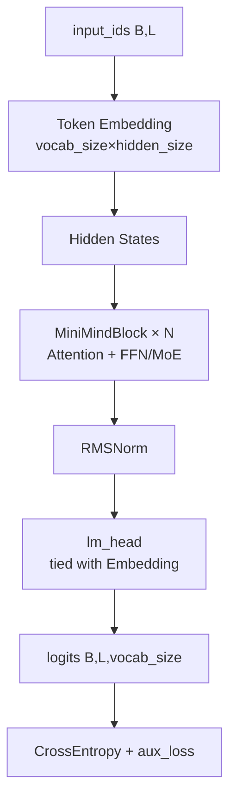

# 03 - 模型架构

> 对应代码：`model/model_minimind.py`（约 700 行，单文件实现完整模型）

## 3.1 总览

MiniMind3 的模型主体是一个**对齐 Qwen3 / Qwen3-MoE 生态**的 Decoder-Only Transformer，单文件即可承载 Dense 与 MoE 两种形态。整体结构如下：



## 3.2 配置类 `MiniMindConfig`

```python
class MiniMindConfig(PretrainedConfig):
    model_type = "minimind"
    def __init__(self, hidden_size=768, num_hidden_layers=8,
                 use_moe=False, **kwargs): ...
```

### 关键字段

| 字段 | 默认 | 说明 |
|------|------|------|
| `hidden_size` | 768 | 隐藏层维度（训练默认 512） |
| `num_hidden_layers` | 8 | Transformer 层数 |
| `num_attention_heads` | 8 | Q 头数 |
| `num_key_value_heads` | 4 | KV 头数（GQA），训练脚本中显式传 2 |
| `head_dim` | hidden_size / num_heads | 每头维度 |
| `intermediate_size` | `ceil(hidden×π/64)×64` | FFN 中间层（约 2.4× hidden） |
| `vocab_size` | 6400 | 词表大小 |
| `max_position_embeddings` | 32768 | 训练支持的最大序列长度 |
| `rope_theta` | 1e6 | RoPE 基频 |
| `flash_attn` | True | 是否使用 SDPA |
| `inference_rope_scaling` | False | 推理时是否启用 YaRN |
| `rope_scaling` | YaRN dict | factor=16, original=2048 |
| `use_moe` | False | 是否启用 MoE |
| `num_experts` | 4 | MoE 专家数 |
| `num_experts_per_tok` | 1 | Top-K 路由 |
| `norm_topk_prob` | True | 是否归一化路由概率 |
| `router_aux_loss_coef` | 5e-4 | 负载均衡损失系数 |

## 3.3 RMSNorm

公式：`RMSNorm(x) = x / sqrt(mean(x²) + eps) * γ`

相比 LayerNorm 去除了均值归一化，速度更快、效果相当。实现上**先 cast 到 fp32 再算 norm，最后 cast 回原 dtype**，确保混合精度下的数值稳定。

```python
def forward(self, x):
    return (self.weight * self.norm(x.float())).type_as(x)
```

## 3.4 RoPE 与 YaRN 长文本外推

### 3.4.1 标准 RoPE

`precompute_freqs_cis` 预计算所有位置的 cos / sin：

```python
freqs = 1.0 / (rope_base ** (torch.arange(0, dim, 2)[:dim//2].float() / dim))
t = torch.arange(end)            # [0, 1, ..., max_len-1]
freqs = torch.outer(t, freqs)    # [max_len, head_dim/2]
freqs_cos = torch.cat([cos, cos], dim=-1)
freqs_sin = torch.cat([sin, sin], dim=-1)
```

应用时：`q_embed = q*cos + rotate_half(q)*sin`，等价于复数旋转。

### 3.4.2 YaRN（Yet another RoPE extensioN）

通过 `inference_rope_scaling=True` 启用，配置如下：

```python
rope_scaling = {
    "type": "yarn",
    "factor": 16,                              # 外推倍数
    "original_max_position_embeddings": 2048,  # 原始训练长度
    "beta_fast": 32, "beta_slow": 1,
    "attention_factor": 1.0,
}
```

核心思想：**对低频维度保持不变，对高频维度按 factor 缩放**，实现平滑外推：

```python
ramp = clamp((arange(dim/2) - low) / (high - low), 0, 1)  # 线性斜坡 γ
freqs = freqs * (1 - ramp + ramp / factor)                 # f'(i) = f(i)((1-γ) + γ/s)
```

得到的 `freqs_cos / freqs_sin` 还会乘上 `attention_factor`（attention 缩放因子），这是 YaRN 论文推荐的稳定性技巧。

## 3.5 多头注意力（GQA + QK Norm + Flash）

`Attention` 类实现了三个关键优化：

### 3.5.1 GQA（Grouped Query Attention）

- Q 头数 `n_local_heads = num_attention_heads`（如 8）
- KV 头数 `n_local_kv_heads = num_key_value_heads`（如 2）
- 每个 KV 头被 `n_rep = n_local_heads // n_local_kv_heads = 4` 个 Q 头共享
- 计算前用 `repeat_kv` 把 KV 复制到与 Q 等量

**收益**：KV Cache 缩小 4 倍，长序列推理显存大幅降低。

### 3.5.2 QK Norm

```python
self.q_norm = RMSNorm(head_dim)
self.k_norm = RMSNorm(head_dim)
```

对 Q 和 K **逐头**归一化，能显著缓解大模型训练初期的注意力数值发散，是 Qwen3 的关键稳定性改进。

### 3.5.3 Flash Attention 与设备适配

```python
if self.flash_attn and seq_len != 1:
    output = F.scaled_dot_product_attention(
        q, k, v, attn_mask=attention_mask,
        dropout_p=dropout_p, is_causal=True)
else:
    # 手动实现：scores = QK^T / √d → softmax → V
    ...
```

> ⚠️ **MPS 性能陷阱**：Apple Silicon 上 SDPA forward 慢 15×、backward 慢 100×+。`train_pretrain.py` 检测到 `device_type == "mps"` 时会自动 `lm_config.flash_attn = False`，回退手动实现。

## 3.6 FFN：SwiGLU MLP

标准 SwiGLU 设计：

```python
def forward(self, x):
    return self.dropout(self.down_proj(
        self.act_fn(self.gate_proj(x)) * self.up_proj(x)))
```

- `gate_proj` / `up_proj` 都是 `hidden → intermediate`
- `down_proj` 是 `intermediate → hidden`
- `act_fn = SiLU`

## 3.7 MoE 实现

启用 `use_moe=True` 时，`MiniMindBlock` 中的 MLP 替换为 `MOEFeedForward`。核心组件：

### 3.7.1 Router

```python
class MoEGate(nn.Module):
    def forward(self, hidden_states):
        logits = F.linear(hidden_states, self.weight)
        scores = logits.softmax(dim=-1)
        topk_weight, topk_idx = torch.topk(scores, self.top_k)
        if self.norm_topk_prob and self.top_k > 1:
            topk_weight = topk_weight / topk_weight.sum(-1, keepdim=True)
        # 计算负载均衡 aux_loss
        ...
        return topk_idx, topk_weight, aux_loss
```

### 3.7.2 负载均衡损失

公式（Switch Transformer 风格）：

```
aux_loss = α * num_experts * Σ_i (f_i * P_i)
```

- `f_i`：第 i 个专家被选中的样本比例
- `P_i`：第 i 个专家的平均路由概率
- `α = router_aux_loss_coef = 5e-4`

加在最终 loss 上，鼓励专家被均匀使用。

### 3.7.3 专家计算

每个 token 根据 Top-K 选中的专家分别计算，再按路由权重加权求和：

```python
# 训练阶段：批量遍历所有专家
for i, expert in enumerate(self.experts):
    out[selected_mask] = expert(input[selected_mask]) * weight
```

注意：MiniMind3 已**移除 shared expert 设计**，纯 routed experts。

## 3.8 整体前向传播

`MiniMindForCausalLM.forward` 的流程：

1. `embed_tokens(input_ids)` → `[B, L, H]`
2. 逐层经过 `MiniMindBlock`：`x = x + Attn(RMSNorm(x))` → `x = x + MLP(RMSNorm(x))`
3. 顶层 `RMSNorm`
4. `lm_head` 投影到 `vocab_size`（**与 Embedding 共享权重**，节省参数）
5. 计算 `loss`（CE） + `aux_loss`（MoE 时累加，否则为 0）
6. 返回 `MoeCausalLMOutputWithPast(loss, aux_loss, logits, past_key_values)`

## 3.9 KV Cache 与 Generation

继承自 `transformers.GenerationMixin`，通过 `past_key_values` 缓存历史 K/V。`Attention.forward` 在 `past_key_value is not None` 时把当前 K/V append 到缓存：

```python
if past_key_value is not None:
    k = torch.cat([past_key_value[0], k], dim=1)
    v = torch.cat([past_key_value[1], v], dim=1)
present = (k, v) if use_cache else None
```

这使得 MiniMind 直接兼容 `model.generate(...)`、`TextStreamer`、`TextIteratorStreamer` 等 transformers 生态的所有推理工具。

## 3.10 参数量估算

```
hidden_size=768, layers=8, vocab=6400, kv_heads=2
≈ Embedding (768×6400)        ≈ 4.9M
+ 8 × Attention (≈ 768²×2.5)  ≈ 12M
+ 8 × MLP (≈ 768×2400×3)      ≈ 44M
+ Norm/其他                    ≈ 1M
─────────────────────────────────
≈ 62M (主线 minimind-3 ≈ 64M)
```

MoE 版（4 expert × MLP 复制）：约 198M 总，A64M 激活。详细统计见 `trainer/trainer_utils.py:get_model_params`。
