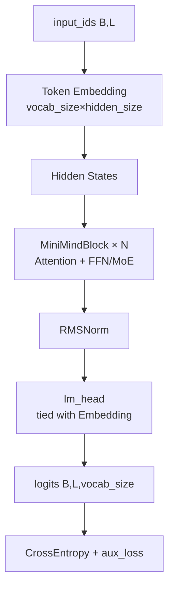

# 03 - 模型架构

> 对应代码：`model/model_minimind.py`（约 700 行，单文件实现完整模型）

## 3.1 总览

想象一下，MiniMind3 就像一个**智能问答系统**。当你问它一个问题时，它需要经历以下几个步骤才能给出回答：

1. **理解你的问题**：把文字转换成数字（Embedding）
2. **深入思考**：通过多层神经网络逐步分析（Transformer Blocks）
3. **整理思路**：对最终的理解结果进行规范化处理（RMSNorm）
4. **给出答案**：从词表中选出最合适的下一个词（lm_head）

整个流程可以用下面的图来表示：



**核心设计理念**：MiniMind3 是一个**对齐 Qwen3 / Qwen3-MoE 生态**的 Decoder-Only Transformer。它的巧妙之处在于，**同一个代码文件可以同时支持两种形态**：
- **Dense 模式**：所有神经元都参与每次计算（传统方式）
- **MoE 模式**：只让部分"专家"神经元参与计算（更高效）

接下来，我们逐个拆解每个组件的作用和原理。

## 3.2 配置类 `MiniMindConfig`

这个配置类就像是模型的"说明书"，告诉模型应该如何构建自己：

```python
class MiniMindConfig(PretrainedConfig):
    model_type = "minimind"
    def __init__(self, hidden_size=768, num_hidden_layers=8,
                 use_moe=False, **kwargs): ...
```

### 关键字段详解

| 字段 | 默认 | 说明 |
|------|------|------|
| `hidden_size` | 768 | 隐藏层维度（训练默认 512）——可以理解为"思维的宽度" |
| `num_hidden_layers` | 8 | Transformer 层数——相当于"思考的深度" |
| `num_attention_heads` | 8 | Q 头数——同时关注不同信息的能力 |
| `num_key_value_heads` | 4 | KV 头数（GQA），训练脚本中显式传 2 |
| `head_dim` | hidden_size / num_heads | 每头维度 |
| `intermediate_size` | `ceil(hidden×π/64)×64` | FFN 中间层（约 2.4× hidden）——"思维扩展空间" |
| `vocab_size` | 6400 | 词表大小——模型认识的词汇量 |
| `max_position_embeddings` | 32768 | 训练支持的最大序列长度 |
| `rope_theta` | 1e6 | RoPE 基频 |
| `flash_attn` | True | 是否使用 SDPA |
| `inference_rope_scaling` | False | 推理时是否启用 YaRN |
| `rope_scaling` | YaRN dict | factor=16, original=2048 |
| `use_moe` | False | 是否启用 MoE |
| `num_experts` | 4 | MoE 专家数 |
| `num_experts_per_tok` | 1 | Top-K 路由 |
| `norm_topk_prob` | True | 是否归一化路由概率 |
| `router_aux_loss_coef` | 5e-4 | 负载均衡损失系数 |

## 3.3 RMSNorm：信号放大器的自动增益控制

### 为什么要用 RMSNorm？

想象你在听收音机，有时候信号太强会爆音，太弱又听不清。**RMSNorm 就像收音机的自动增益控制（AGC）**，它能确保信号始终保持在合适的强度范围内，既不会太大也不会太小。

传统的 LayerNorm 会同时调整信号的"平均值"和"方差"，但研究发现，**只需要调整方差就够了**。这就好比调节音量时，你只需要关心声音的大小，不需要关心音调的高低。去掉均值归一化后，计算速度更快，效果却几乎一样好。

### 工作原理

公式：`RMSNorm(x) = x / sqrt(mean(x²) + eps) * γ`

这里的 `mean(x²)` 计算的是信号的均方根（RMS），也就是信号的"平均强度"。除以这个值后，信号就被标准化到合适的范围。最后的 `γ` 是一个可学习的缩放因子，让模型自己决定最终的信号强度。

### 数值稳定性技巧

在混合精度训练中，直接用 fp16 计算可能会导致数值溢出或下溢。所以实现上有一个小技巧：**先 cast 到 fp32 再算 norm，最后 cast 回原 dtype**：

```python
def forward(self, x):
    return (self.weight * self.norm(x.float())).type_as(x)
```

这就像是用高精度天平称重，然后再把结果转换回普通精度记录，确保计算过程不会丢失精度。

## 3.4 RoPE 与 YaRN：给单词贴上位置标签

### 3.4.1 标准 RoPE：为什么需要位置信息？

**问题**：Transformer 本身是"并行处理"所有词的，它不知道"我爱你"和"你爱我"的区别，因为词序信息丢失了。

**解决方案**：RoPE（Rotary Positional Embedding）就像**给每个单词贴上带有位置信息的标签**。这个标签不是简单的编号，而是一种"旋转编码"，让模型能够感知词与词之间的相对距离。

#### 直觉理解

想象你和朋友在玩传话游戏。如果只告诉你"苹果"和"好吃"这两个词，你不知道是谁好吃。但如果告诉你"苹果在位置1，好吃在位置2"，你就能理解"苹果好吃"的意思。

RoPE 的做法更巧妙：它不是直接加上位置编号，而是**把每个词的向量在复数平面上旋转一个角度**，旋转的角度取决于这个词的位置。这样，两个词的相对位置就体现在它们向量的夹角中了。

#### 数学实现

`precompute_freqs_cis` 预计算所有位置的 cos / sin：

```python
freqs = 1.0 / (rope_base ** (torch.arange(0, dim, 2)[:dim//2].float() / dim))
t = torch.arange(end)            # [0, 1, ..., max_len-1]
freqs = torch.outer(t, freqs)    # [max_len, head_dim/2]
freqs_cos = torch.cat([cos, cos], dim=-1)
freqs_sin = torch.cat([sin, sin], dim=-1)
```

应用时：`q_embed = q*cos + rotate_half(q)*sin`，这等价于在复数平面上旋转向量。

### 3.4.2 YaRN：如何让模型读懂更长的文章？

**问题**：模型训练时只见过长度为 2048 的文章，但你想让它处理 32768 长度的长文档，怎么办？

**类比**：就像你只学过阅读短篇故事，现在要读长篇小说。YaRN 的策略是**重新调整"位置标签"的刻度**，让模型能够平滑地外推到更长的序列。

#### 核心思想

YaRN（Yet another RoPE extensioN）通过 `inference_rope_scaling=True` 启用，配置如下：

```python
rope_scaling = {
    "type": "yarn",
    "factor": 16,                              # 外推倍数
    "original_max_position_embeddings": 2048,  # 原始训练长度
    "beta_fast": 32, "beta_slow": 1,
    "attention_factor": 1.0,
}
```

**关键洞察**：不是所有位置信息都同等重要。低频信息（长距离依赖）需要保持不变，高频信息（短距离依赖）可以压缩。YaRN 用一个**线性斜坡函数**来平滑过渡：

```python
ramp = clamp((arange(dim/2) - low) / (high - low), 0, 1)  # 线性斜坡 γ
freqs = freqs * (1 - ramp + ramp / factor)                 # f'(i) = f(i)((1-γ) + γ/s)
```

得到的 `freqs_cos / freqs_sin` 还会乘上 `attention_factor`（attention 缩放因子），这是 YaRN 论文推荐的稳定性技巧。

## 3.5 多头注意力：高效的信息检索机制

`Attention` 类实现了三个关键优化，让我们逐一拆解。

### 3.5.1 GQA：多个学生共用一份笔记

**问题**：传统的多头注意力（MHA）中，每个 Query 头都需要独立的 Key 和 Value，这会占用大量显存，尤其是处理长序列时。

**类比**：想象一个教室里有 8 个学生（Q 头），如果每个学生都要单独记一份笔记（KV），那需要 8 份笔记。但如果让 4 个学生共用一份笔记，只需要 2 份笔记就够了。这就是 **GQA（Grouped Query Attention）** 的核心思想。

#### 工作原理

- Q 头数 `n_local_heads = num_attention_heads`（如 8）
- KV 头数 `n_local_kv_heads = num_key_value_heads`（如 2）
- 每个 KV 头被 `n_rep = n_local_heads // n_local_kv_heads = 4` 个 Q 头共享
- 计算前用 `repeat_kv` 把 KV 复制到与 Q 等量

**收益**：KV Cache 缩小 4 倍，长序列推理显存大幅降低。

### 3.5.2 QK Norm：防止注意力数值爆炸

**问题**：在大模型训练初期，Query 和 Key 的值可能会变得非常大或非常小，导致注意力分数不稳定，训练难以收敛。

**解决方案**：对 Q 和 K **逐头**进行归一化，就像给每个学生的发言音量设定上限，确保大家的声音都在合理范围内。

```python
self.q_norm = RMSNorm(head_dim)
self.k_norm = RMSNorm(head_dim)
```

这是 Qwen3 的关键稳定性改进，能显著缓解训练初期的注意力数值发散。

### 3.5.3 Flash Attention：批量处理考试卷

**问题**：传统的注意力计算需要多次访问内存，速度慢且显存占用高。

**类比**：想象老师在批改考试卷。传统方法是：拿起一份卷子 → 翻到第一题 → 打分 → 放下卷子 → 拿起下一份卷子……这样来回折腾很慢。**Flash Attention 就像一次性把所有卷子摊开在桌上，批量处理**，减少来回翻找的时间。

#### 实现策略

```python
if self.flash_attn and seq_len != 1:
    output = F.scaled_dot_product_attention(
        q, k, v, attn_mask=attention_mask,
        dropout_p=dropout_p, is_causal=True)
else:
    # 手动实现：scores = QK^T / √d → softmax → V
    ...
```

> ⚠️ **MPS 性能陷阱**：Apple Silicon 上 SDPA forward 慢 15×、backward 慢 100×+。`train_pretrain.py` 检测到 `device_type == "mps"` 时会自动 `lm_config.flash_attn = False`，回退手动实现。

## 3.6 FFN：SwiGLU —— 两条流水线交叉检验

### 为什么需要 SwiGLU？

**类比**：想象一个工厂有两条生产线。传统 MLP 只有一条线：原料 → 加工 → 成品。而 **SwiGLU 有两条线交叉检验**：
- **Gate 线**：决定哪些信息重要（门控）
- **Up 线**：提取特征（扩展）
- 两条线的输出相乘，相当于"重要性 × 特征值"，只有既重要又有特征的信息才会被保留

这种设计让模型能够更精细地控制信息流动。

### 标准 SwiGLU 设计

```python
def forward(self, x):
    return self.dropout(self.down_proj(
        self.act_fn(self.gate_proj(x)) * self.up_proj(x)))
```

- `gate_proj` / `up_proj` 都是 `hidden → intermediate`
- `down_proj` 是 `intermediate → hidden`
- `act_fn = SiLU`（Sigmoid Linear Unit，一种平滑的激活函数）

## 3.7 MoE：医院的分诊台

### 3.7.1 核心思想

**问题**：Dense 模型中，所有神经元都参与每次计算，浪费算力。

**类比**：想象一家大型医院。如果每个病人都要看所有科室的医生，效率极低。**MoE（Mixture of Experts）就像医院的分诊台**：
- 病人（输入 token）来到分诊台（Router）
- 分诊台根据病情（token 特征）判断应该去哪个科室（Expert）
- 只让相关的专家医生参与诊断，其他医生休息

这样既节省了资源，又能保证专业性。

### 3.7.2 Router：分诊台的决策逻辑

```python
class MoEGate(nn.Module):
    def forward(self, hidden_states):
        logits = F.linear(hidden_states, self.weight)
        scores = logits.softmax(dim=-1)
        topk_weight, topk_idx = torch.topk(scores, self.top_k)
        if self.norm_topk_prob and self.top_k > 1:
            topk_weight = topk_weight / topk_weight.sum(-1, keepdim=True)
        # 计算负载均衡 aux_loss
        ...
        return topk_idx, topk_weight, aux_loss
```

Router 的工作流程：
1. 计算每个专家的"匹配度"（logits）
2. 用 softmax 转换成概率分布
3. 选出 Top-K 个最匹配的专家
4. 如果需要，归一化路由概率（确保权重之和为 1）

### 3.7.3 负载均衡损失：防止某些专家过劳

**问题**：如果分诊台总是把病人派给同一个医生，那个医生会累死，其他医生却闲着。

**解决方案**：引入负载均衡损失（aux_loss），鼓励分诊台均匀分配病人。

公式（Switch Transformer 风格）：

```
aux_loss = α * num_experts * Σ_i (f_i * P_i)
```

- `f_i`：第 i 个专家被选中的样本比例
- `P_i`：第 i 个专家的平均路由概率
- `α = router_aux_loss_coef = 5e-4`

这个损失加在最终 loss 上，惩罚不均衡的路由策略。

### 3.7.4 专家计算：并行会诊

每个 token 根据 Top-K 选中的专家分别计算，再按路由权重加权求和：

```python
# 训练阶段：批量遍历所有专家
for i, expert in enumerate(self.experts):
    out[selected_mask] = expert(input[selected_mask]) * weight
```

注意：MiniMind3 已**移除 shared expert 设计**，纯 routed experts（纯分诊模式，没有全科医生）。

## 3.8 整体前向传播：从输入到输出的完整旅程

`MiniMindForCausalLM.forward` 的流程就像一次完整的思考过程：

1. **理解问题**：`embed_tokens(input_ids)` → `[B, L, H]`，把文字转换成向量
2. **深入思考**：逐层经过 `MiniMindBlock`：
   - `x = x + Attn(RMSNorm(x))`：注意力机制捕捉上下文关系
   - `x = x + MLP(RMSNorm(x))`：FFN/MoE 进行特征提取和转换
3. **整理思路**：顶层 `RMSNorm`，对最终的理解结果进行规范化
4. **给出答案**：`lm_head` 投影到 `vocab_size`（**与 Embedding 共享权重**，节省参数）
5. **评估表现**：计算 `loss`（CE） + `aux_loss`（MoE 时累加，否则为 0）
6. **返回结果**：`MoeCausalLMOutputWithPast(loss, aux_loss, logits, past_key_values)`

## 3.9 KV Cache：记住之前说过的话

**类比**：想象你在和朋友聊天。如果每说一句话都要重新回忆之前的所有内容，效率太低。**KV Cache 就像聊天记录**，保存了之前对话的 Key 和 Value，新的一句话只需要关注最新的内容，然后和之前的记录拼接起来。

继承自 `transformers.GenerationMixin`，通过 `past_key_values` 缓存历史 K/V。`Attention.forward` 在 `past_key_value is not None` 时把当前 K/V append 到缓存：

```python
if past_key_value is not None:
    k = torch.cat([past_key_value[0], k], dim=1)
    v = torch.cat([past_key_value[1], v], dim=1)
present = (k, v) if use_cache else None
```

这使得 MiniMind 直接兼容 `model.generate(...)`、`TextStreamer`、`TextIteratorStreamer` 等 transformers 生态的所有推理工具。

## 3.10 参数量估算：模型有多大？

让我们算一笔账，看看 MiniMind3 到底有多少参数：

```
hidden_size=768, layers=8, vocab=6400, kv_heads=2
≈ Embedding (768×6400)        ≈ 4.9M
+ 8 × Attention (≈ 768²×2.5)  ≈ 12M
+ 8 × MLP (≈ 768×2400×3)      ≈ 44M
+ Norm/其他                    ≈ 1M
─────────────────────────────────
≈ 62M (主线 minimind-3 ≈ 64M)
```

**分解说明**：
- **Embedding**：词表嵌入，把 6400 个词映射到 768 维向量
- **Attention**：每层的注意力机制，主要是 Q/K/V 投影矩阵
- **MLP**：每层的前馈网络，包含 gate/up/down 三个投影
- **Norm/其他**：归一化层、偏置项等小部件

MoE 版（4 expert × MLP 复制）：约 198M 总，A64M 激活。详细统计见 `trainer/trainer_utils.py:get_model_params`。

**关键洞察**：MoE 虽然总参数多（198M），但每次只激活部分专家（64M），所以推理速度和 Dense 版（64M）差不多，但表达能力更强。
