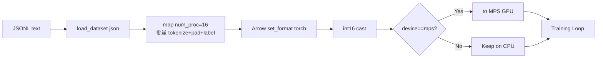

# 05 - 数据管道

> 本文档对应 `dataset/lm_dataset.py`，逐一解读 5 类 Dataset 的处理流程与工程优化。

## 5.1 数据格式约定

所有数据集均采用 **JSONL** 格式，按训练阶段约定字段：

| 阶段 | 默认文件 | 顶层字段 |
|------|---------|---------|
| Pretrain | `pretrain_t2t_mini.jsonl` | `text` |
| SFT | `sft_t2t_mini.jsonl` | `conversations: [{role, content, reasoning_content, tools, tool_calls}]` |
| DPO | `dpo.jsonl` | `chosen: [...], rejected: [...]` |
| RLAIF | `rlaif.jsonl` | `conversations: [...]` |
| Agent RL | `agent_rl.jsonl` | `conversations: [...]`, `gt`（ground-truth answer） |

数据集放在仓库根目录的 `.dataset/` 下，`dataset/dataset.md` 仅用于占位说明。

## 5.2 PretrainDataset（关键工程优化）

`dataset/lm_dataset.py:PretrainDataset` 实现了**初始化时一次性预 tokenize 全部数据**，结合多重优化大幅提升训练吞吐：

### 5.2.1 多进程并行 Tokenize

```python
num_proc = min(os.cpu_count() or 1, 16)
tokenized = raw_samples.map(
    _pretrain_tokenize_and_pad,
    batched=True, batch_size=1000, num_proc=num_proc,
    fn_kwargs={'tokenizer': tokenizer, ...}
)
```

`_pretrain_tokenize_and_pad` 是**模块级**函数，确保 `datasets.map` 的多进程 fork 可序列化。它做三件事：

1. 截断 + 添加 `bos/eos` token
2. 右侧 padding 到 `max_length`
3. 生成 labels：padding 位置写 `-100`

### 5.2.2 紧凑存储（int16）

由于 `vocab_size = 6400 < 32767`，input_ids 可以用 `int16` 存储，**内存减少 75%**：

```python
storage_dtype = torch.int16 if tokenizer.vocab_size < 32767 else torch.long
```

`__getitem__` 返回时再 `.long()` 转回，几乎无 GPU 端开销。

### 5.2.3 MPS 统一内存零拷贝

Apple Silicon 的 CPU 和 GPU 共享统一内存，因此可以**直接把数据存在 GPU 上**，训练时零拷贝：

```python
if device is not None and str(device) != 'cpu':
    self.input_ids = self.input_ids.to(device)
    self.labels = self.labels.to(device)
```

配合 `train_pretrain.py` 中：

```python
if device_type == "mps":
    args.num_workers = 0   # 关闭 DataLoader 多进程
```

避免跨进程拷贝 GPU tensor 的巨大开销。

### 5.2.4 数据流总览



## 5.3 SFTDataset

与 Pretrain 类似，同样使用 `datasets.map` 多进程预处理。差异在于内层 `_sft_tokenize_batch`：

1. 调用 `pre_processing_chat` 概率注入 system
2. 用 `tokenizer.apply_chat_template(messages, tools=tools)` 生成 prompt 字符串
3. `post_processing_chat` 概率移除空 `<think>` 块
4. tokenize → 右侧 pad
5. 通过 `_sft_generate_labels` 用 `<|im_start|>assistant\n` / `<|im_end|>\n` 作为 marker 生成 mask（参见 [04 - Tokenizer](./04-tokenizer-and-chat-template.md#45-sft-标签的-mask-生成)）

## 5.4 DPODataset

每条样本同时返回 `chosen` 和 `rejected` 两条对话经过 chat template 后的序列：

```python
{
  'x_chosen': [seq[:-1]],         # 输入
  'y_chosen': [seq[1:]],          # 错位 1 token 的 label
  'mask_chosen': [...],           # 仅 assistant 区段为 1
  'x_rejected': ..., 'y_rejected': ..., 'mask_rejected': ...
}
```

`generate_loss_mask` 与 SFT 类似，识别 `<|im_start|>assistant\n` 区段。训练时 chosen / rejected 会被 `torch.cat` 在 batch 维拼起来，前半 chosen、后半 rejected。

## 5.5 RLAIFDataset

为 RLAIF（PPO/GRPO/CISPO）训练准备**只含 prompt** 的样本：

```python
return {'prompt': prompt_str, 'answer': ""}
```

特殊点：
- `thinking_ratio=0.5`：每条样本独立按 50% 概率开启 `open_thinking`，让 RL 同时学会"想"和"不想"
- 只取 `conversations[:-1]` 作为 prompt，`add_generation_prompt=True`

## 5.6 AgentRLDataset

为多轮 Tool Use 强化学习准备：

```python
return {'messages': messages[:-1], 'tools': tools, 'gt': sample['gt']}
```

- `tools` 从 system 消息中解析
- `gt` 是 ground-truth 答案，用于奖励计算（例如数学题答案正确性）
- 与 RLAIF 不同，**Rollout 在 trainer 中以多轮形式进行**（见 `train_agent.py:rollout_single`）

## 5.7 5 类 Dataset 对比

| Dataset | 是否预 tokenize | 返回字段 | 标签 mask 策略 | 用于 |
|---------|---------------|---------|--------------|------|
| `PretrainDataset` | ✅ 全量预处理 | `(input_ids, labels)` | 仅 padding 位 `-100` | Pretrain |
| `SFTDataset` | ✅ 全量预处理 | `(input_ids, labels)` | 仅 assistant 区段保留 | SFT / Distill / LoRA |
| `DPODataset` | ❌ 实时 | dict（chosen/rejected） | 仅 assistant 区段为 1 | DPO |
| `RLAIFDataset` | ❌ 实时 | `{prompt, answer}` | 不需要（RL） | PPO/GRPO/CISPO |
| `AgentRLDataset` | ❌ 实时 | `{messages, tools, gt}` | 不需要（多轮 rollout） | Agent RL |

## 5.8 性能调优建议

| 场景 | 建议 |
|------|------|
| Linux + 多核 CPU | 默认即可，自动用 `min(cpu_count, 16)` 进程预处理 |
| 数据量小（<1000） | 自动退化为单进程，避免 fork 开销 |
| MPS 设备 | 设备传 `device='mps'`，DataLoader workers=0 |
| 词表大于 32767 | 自动用 `int64`，无需手动配置 |
| 内存吃紧 | 减小 `batch_size` 或拆分 JSONL 多次训练 |
