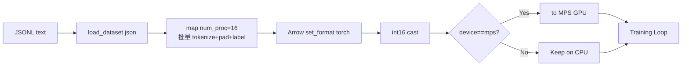

# 05 - 数据管道：像食品加工厂一样的数据处理流水线

> 本文档对应 `dataset/lm_dataset.py`，逐一解读 5 类 Dataset 的处理流程与工程优化。

## 5.1 数据格式约定：原材料的标准包装

想象一下，如果我们要开一家餐厅（训练模型），首先需要从供应商那里采购各种食材（原始数据）。为了让厨房（训练程序）能够高效处理这些食材，我们需要对它们进行标准化的包装。

所有数据集均采用 **JSONL** 格式，就像给每种食材贴上标准标签：

| 阶段 | 默认文件 | 顶层字段 | 说明 |
|------|---------|---------|------|
| Pretrain | `pretrain_t2t_mini.jsonl` | `text` | 纯文本，就像散装大米 |
| SFT | `sft_t2t_mini.jsonl` | `conversations: [{role, content, reasoning_content, tools, tool_calls}]` | 对话记录，就像预制好的套餐 |
| DPO | `dpo.jsonl` | `chosen: [...], rejected: [...]` | 对比数据，就像两份不同口味的菜品供选择 |
| RLAIF | `rlaif.jsonl` | `conversations: [...]` | 强化学习数据，就像需要厨师现场发挥的食材 |
| Agent RL | `agent_rl.jsonl` | `conversations: [...]`, `gt`（ground-truth answer） | 工具调用数据，就像需要特殊厨具处理的食材 |

数据集放在仓库根目录的 `.dataset/` 下，就像我们的中央仓库。`dataset/dataset.md` 仅用于占位说明，就像仓库门口的标识牌。

## 5.2 PretrainDataset：预制菜 vs 现做的智慧选择

`dataset/lm_dataset.py:PretrainDataset` 实现了一个聪明的策略：**在开业前就把所有食材都处理好**（初始化时一次性预 tokenize 全部数据）。这就像餐厅里的"预制菜"概念——提前把菜洗好、切好、甚至半熟处理，客人点单时只需简单加热即可上桌，比每次现做快得多。

### 5.2.1 多进程并行 Tokenize：多个厨师同时备菜

```python
num_proc = min(os.cpu_count() or 1, 16)
tokenized = raw_samples.map(
    _pretrain_tokenize_and_pad,
    batched=True, batch_size=1000, num_proc=num_proc,
    fn_kwargs={'tokenizer': tokenizer, ...}
)
```

这里我们请了最多 16 个厨师（进程）同时备菜。`_pretrain_tokenize_and_pad` 是一个标准的菜谱（模块级函数），确保每个厨师都能按照同样的方式处理食材。它做三件事：

1. **修剪食材**：截断过长的文本，加上开始和结束标记（bos/eos token），就像去掉蔬菜的老叶，加上包装标签
2. **统一规格**：右侧 padding 到固定长度（max_length），就像把所有肉块切成同样大小
3. **标记不可食用部分**：生成 labels，padding 位置写 `-100`，就像标记哪些部分是边角料不能上桌

### 5.2.2 紧凑存储（int16）：用小号容器装小物品

由于我们的词表大小只有 6400 个词（vocab_size = 6400 < 32767），就像我们只需要装苹果这样的小水果，不需要用卡车来运输。因此 input_ids 可以用 `int16` 存储，**内存减少 75%**：

```python
storage_dtype = torch.int16 if tokenizer.vocab_size < 32767 else torch.long
```

这就像用小盒子装小物件，而不是用大箱子。`__getitem__` 返回时再 `.long()` 转回，就像上桌前换个漂亮的盘子，几乎不花时间。

### 5.2.3 MPS 统一内存零拷贝：厨房和冰箱在同一个房间

Apple Silicon 的 CPU 和 GPU 共享统一内存，这就像**厨房和冰箱在同一个房间**——厨师不需要跑到隔壁楼去取食材，伸手就能拿到。因此我们可以**直接把数据存在 GPU 上**，训练时零拷贝：

```python
if device is not None and str(device) != 'cpu':
    self.input_ids = self.input_ids.to(device)
    self.labels = self.labels.to(device)
```

配合 `train_pretrain.py` 中：

```python
if device_type == "mps":
    args.num_workers = 0   # 关闭 DataLoader 多进程
```

这就像既然冰箱就在厨房里，就不需要专门的搬运工（多进程）来运送食材了，避免跨进程拷贝 GPU tensor 的巨大开销。

### 5.2.4 数据流总览：从原材料到成品的完整流程



这个流程图展示了从原始 JSONL 文本到最终送入训练循环的完整过程，就像展示从采购食材到上桌的全过程。

## 5.3 SFTDataset：精心搭配的套餐制作

SFTDataset 的处理方式与 Pretrain 类似，同样使用 `datasets.map` 多进程预处理。但它的内层 `_sft_tokenize_batch` 更像是在制作精心搭配的套餐：

1. **添加特色调料**：调用 `pre_processing_chat` 概率注入 system，就像根据客人口味添加特色调料
2. **按照标准配方组装**：用 `tokenizer.apply_chat_template(messages, tools=tools)` 生成 prompt 字符串，就像按照标准食谱组装套餐
3. **去除多余装饰**：`post_processing_chat` 概率移除空 `<think>` 块，就像去掉不必要的装饰
4. **标准化包装**：tokenize → 右侧 pad，就像统一包装规格
5. **标记可食用部分**：通过 `_sft_generate_labels` 用 `<|im_start|>assistant\n` / `<|im_end|>\n` 作为 marker 生成 mask（参见 [04 - Tokenizer](./04-tokenizer-and-chat-template.md#45-sft-标签的-mask-生成)）

## 5.4 DPODataset：双拼套餐的对比选择

DPODataset 就像是为顾客提供两种不同口味的菜品供选择，每条样本同时返回 `chosen`（被选择的）和 `rejected`（被拒绝的）两条对话经过 chat template 后的序列：

```python
{
  'x_chosen': [seq[:-1]],         # 输入
  'y_chosen': [seq[1:]],          # 错位 1 token 的 label
  'mask_chosen': [...],           # 仅 assistant 区段为 1
  'x_rejected': ..., 'y_rejected': ..., 'mask_rejected': ...
}
```

`generate_loss_mask` 与 SFT 类似，识别 `<|im_start|>assistant\n` 区段。训练时 chosen / rejected 会被 `torch.cat` 在 batch 维拼起来，前半 chosen、后半 rejected。

## 5.5 RLAIFDataset：只给食材，让厨师自由发挥

**类比**：前面的 Dataset 都是"把菜做好端上来"，而 RLAIFDataset 像是给大厨一堆食材，让他自由发挥创作——我们只提供 prompt（食材），response 由模型在训练时现场生成（rollout）。

为 RLAIF（PPO/GRPO/CISPO）训练准备**只含 prompt** 的样本：

```python
return {'prompt': prompt_str, 'answer': ""}
```

特殊点：
- `thinking_ratio=0.5`：每条样本独立按 50% 概率开启 `open_thinking`，让 RL 同时学会"想"和"不想"
- 只取 `conversations[:-1]` 作为 prompt，`add_generation_prompt=True`

## 5.6 AgentRLDataset：带工具箱的实战考试

**类比**：如果 RLAIFDataset 是让厨师自由创作，那 AgentRLDataset 就像是给厨师配上各种厨具（tools），让他做一道指定的菜（gt），看他能不能正确使用厨具完成任务。关键区别是——这是一道**多步骤**的菜，可能需要先切菜、再炒、再摆盘（多轮 tool use）。

为多轮 Tool Use 强化学习准备：

```python
return {'messages': messages[:-1], 'tools': tools, 'gt': sample['gt']}
```

- `tools` 从 system 消息中解析
- `gt` 是 ground-truth 答案，用于奖励计算（例如数学题答案正确性）
- 与 RLAIF 不同，**Rollout 在 trainer 中以多轮形式进行**（见 `train_agent.py:rollout_single`）

## 5.7 5 类 Dataset 对比

| Dataset | 是否预 tokenize | 返回字段 | 标签 mask 策略 | 用于 |
|---------|---------------|---------|--------------|------|
| `PretrainDataset` | ✅ 全量预处理 | `(input_ids, labels)` | 仅 padding 位 `-100` | Pretrain |
| `SFTDataset` | ✅ 全量预处理 | `(input_ids, labels)` | 仅 assistant 区段保留 | SFT / Distill / LoRA |
| `DPODataset` | ❌ 实时 | dict（chosen/rejected） | 仅 assistant 区段为 1 | DPO |
| `RLAIFDataset` | ❌ 实时 | `{prompt, answer}` | 不需要（RL） | PPO/GRPO/CISPO |
| `AgentRLDataset` | ❌ 实时 | `{messages, tools, gt}` | 不需要（多轮 rollout） | Agent RL |

## 5.8 性能调优建议

| 场景 | 建议 |
|------|------|
| Linux + 多核 CPU | 默认即可，自动用 `min(cpu_count, 16)` 进程预处理 |
| 数据量小（<1000） | 自动退化为单进程，避免 fork 开销 |
| MPS 设备 | 设备传 `device='mps'`，DataLoader workers=0 |
| 词表大于 32767 | 自动用 `int64`，无需手动配置 |
| 内存吃紧 | 减小 `batch_size` 或拆分 JSONL 多次训练 |
