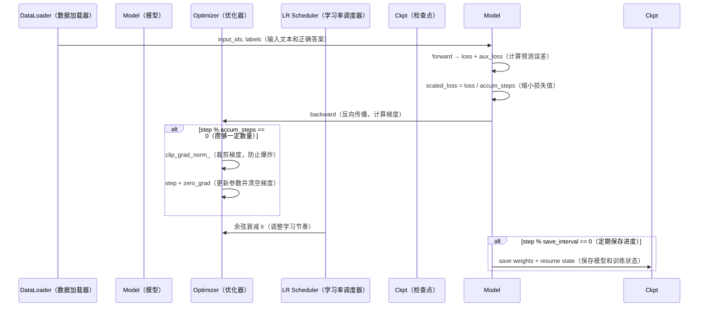

# 06 - 预训练与 SFT：从"学说话"到"懂礼仪"

> 对应代码：`trainer/train_pretrain.py`（454 行）+ `trainer/train_full_sft.py`（201 行）

## 6.1 两阶段定位：为什么需要两个阶段？

想象你在培养一个 AI 助手，这个过程就像教一个孩子成长：

### **第一阶段：Pretrain（预训练）—— 让婴儿学说话**

**核心目标**：通过大量阅读，让模型掌握语言的内在规律。

就像一个婴儿在学会对话之前，需要先听父母说成千上万句话，观察文字的组合方式。预训练就是让模型"泡"在海量文本中，学习：
- 词语如何搭配（"天空"后面常跟"蓝色"）
- 句子的结构（主谓宾的顺序）
- 世界的常识（"苹果"是一种水果）

**关键特征**：
- **学习方式**：预测下一个词（Next Token Prediction）—— 读了一句话的前半部分，猜后半部分
- **数据来源**：纯文本（书籍、网页、文章），没有问答格式
- **学习强度**：高强度（学习率 5e-4），因为要从零开始建立认知
- **梯度累积**：32 步才更新一次参数（像攒够一车快递再发货，提高效率）

### **第二阶段：Full SFT（监督微调）—— 教小孩对话礼仪**

**核心目标**：让模型学会"别人问话时应该如何回答"。

当孩子已经会说话了，你需要教他社交礼仪：别人提问时要回答，而不是自顾自地继续讲故事。SFT 就是教模型这种"对话规则"。

**关键特征**：
- **学习方式**：学习对话格式（ChatML）—— 识别用户问题，生成助手回答
- **数据来源**：多轮对话数据（包含 Tool Call 能力）
- **学习强度**：低强度（学习率 1e-5，比预训练低 **50 倍**）
- **为什么学习率要低？** 因为要保护预训练阶段学到的知识，避免"灾难性遗忘"。就像你已经学会了说话，现在只是学习礼貌用语，不需要重新学语言本身。
- **梯度累积**：8 步更新一次（对话数据更珍贵，不需要攒太多）

### 对比总结

| 维度 | Pretrain（学说话） | Full SFT（学礼仪） |
|------|----------|----------|
| **类比** | 婴儿通过听大量话语学会语言规律 | 教孩子知道别人问话时应该回答 |
| **目标** | 让模型学会语言建模（Next Token） | 让模型学会按 ChatML 对齐人类指令 |
| **数据** | 纯文本 `pretrain_t2t_mini.jsonl` | 多轮对话 `sft_t2t_mini.jsonl`（含 Tool Call） |
| **Loss 区域** | 全部 token（除 padding） | 仅 assistant 区段（只关心助手的回答质量） |
| **起点权重** | `none`（随机初始化，从零开始） | `pretrain`（站在预训练的肩膀上） |
| **学习率** | **5e-4**（高，快速建立认知） | **1e-5**（低 50 倍，精雕细琢，保护已有知识） |
| **梯度累积** | 32（攒够 32 批再提交，像快递凑满一车） | 8（对话数据珍贵，不需要攒太多） |
| **默认 max_seq_len** | 340（短句为主） | 768（对话可能更长） |
| **推荐 epochs** | 2（看两遍就够了） | 2（反复练习对话技巧） |

---

## 6.2 启动命令

```bash
# Pretrain（默认参数）—— 让模型开始"学说话"
python trainer/train_pretrain.py \
    --hidden_size 512 --num_hidden_layers 8 \
    --batch_size 8 --epochs 2 \
    --data_path .dataset/pretrain_t2t_mini.jsonl

# Full SFT —— 教模型"对话礼仪"
python trainer/train_full_sft.py \
    --from_weight pretrain --save_weight full_sft \
    --batch_size 8 --epochs 2

# DDP 多卡（NCCL）—— 多个老师一起教，加速学习
torchrun --nproc_per_node=8 trainer/train_pretrain.py [...args]
```

---

## 6.3 训练循环关键步骤：模型是如何学习的？



### 6.3.1 前向传播 + 损失计算

```python
res = model(input_ids, labels=labels)
loss = res.loss + res.aux_loss      # MoE 架构才有 aux_loss（辅助损失）
scaled_loss = loss / args.accumulation_steps
```

**解释**：模型先做出预测，然后和正确答案对比，计算出"错误程度"（loss）。如果是 MoE（混合专家）架构，还要加上辅助损失来平衡各个专家的负载。

### 6.3.2 梯度累积：攒够一定数量再提交

**类比**：就像快递公司不会每收到一个包裹就发车，而是等攒满一车再统一发货，这样效率更高。

每 `accumulation_steps` 步才真正更新一次参数，等价于把 batch 放大 `accumulation_steps` 倍：

```
effective_batch_size = batch_size × accumulation_steps × world_size
                     = 8 × 32 × 1 = 256 (单卡 Pretrain 默认)
```

**为什么这样做？**
- 显存有限，无法一次性处理大 batch
- 通过累积小 batch 的梯度，模拟大 batch 的效果
- 既节省显存，又保持训练稳定性

### 6.3.3 梯度裁剪：防止学习"走火入魔"

```python
scaler.unscale_(optimizer)
torch.nn.utils.clip_grad_norm_(model.parameters(), args.grad_clip)  # 默认 1.0
scaler.step(optimizer); scaler.update()
optimizer.zero_grad(set_to_none=True)
```

**解释**：如果某次学习的"冲击"太大（梯度过大），可能会破坏已经学到的知识。梯度裁剪就像给学习设置一个"安全阀"，确保每次更新的幅度在合理范围内。

### 6.3.4 学习率调度：学习节奏的艺术

`trainer_utils.get_lr` 是一个**无 warmup 的余弦退火**策略：

```
lr(t) = lr_init × (0.1 + 0.45 × (1 + cos(π × t / total_steps)))
```

**类比**：学习就像读书，开始时快速浏览建立整体框架（高学习率），后期精雕细琢深入理解（低学习率）。

- **起点**：`lr_init`（初始学习率，快速学习阶段）
- **终点**：`0.1 × lr_init`（最低降到初始值的 10%，精细调整阶段）
- **形状**：单峰余弦下降（平滑过渡，避免突变）

**可视化曲线**：
```
学习率
  |
  |\
  | \
  |  \
  |   \___________
  |               \
  |________________\______ 训练步数
  开始              结束
```

---

## 6.4 Pretrain 的吞吐优化要点：如何让训练更快？

`train_pretrain.py` 在工程上做了大量针对性优化，就像给赛车加装各种性能部件：

| 优化项 | 实现位置 | 收益 | 类比解释 |
|--------|---------|------|----------|
| GPU loss 累加 | `running_loss_sum += loss.detach()` | 减少 GPU→CPU 同步 | 不在每次计算后停下来汇报，最后统一统计 |
| 仅日志步 `.item()` | `is_log_step` 分支 | 大幅降低同步开销 | 只在关键时刻查看详细数据 |
| 提前打印 first batch | `first_step_logged` flag | 帮助定位 hang | 第一步就打招呼，确认系统正常启动 |
| 自动 ETA + tok/s | `make_progress_bar` + `format_duration` | 训练体感好 | 实时显示"预计还需多久完成" |
| TF32 + cuDNN benchmark | `torch.backends.cuda.matmul.allow_tf32 = True` | A100 上 ~30% 提升 | 使用更快的计算精度（牺牲微小精度换取速度） |
| `expandable_segments` | `PYTORCH_CUDA_ALLOC_CONF` | 减少显存碎片 | 智能管理显存，避免浪费 |
| MPS 数据零拷贝 | `train_ds = PretrainDataset(..., device=mps_device)` | Apple Silicon 推理 ~2× | Apple 芯片上避免数据来回复制 |
| MPS 关闭 SDPA/AMP | `lm_config.flash_attn = False` 等 | 避免 100× 反向慢 | Apple 芯片上某些加速功能反而更慢，关掉它们 |

---

## 6.5 SFT 与 Pretrain 的差异：只有三处不同

SFT 的训练流程和 Pretrain 几乎完全一样，只有三个关键差异：

1. **数据集不同**：`SFTDataset` 而非 `PretrainDataset`
   - Pretrain：所有 token 都参与学习
   - SFT：labels 只在 assistant 区段非 `-100`（只关心助手的回答，不关心用户的提问）

2. **学习率不同**：1e-5（低 50×）
   - **为什么？** 避免破坏预训练知识。就像你已经学会了说话，现在只是学习礼貌用语，不需要大幅度改变语言习惯。

3. **起点权重不同**：`--from_weight pretrain`（自动加载 `out/pretrain_*.pth`）
   - 不是从零开始，而是站在预训练的肩膀上继续学习

其余的训练循环、混合精度、断点续训、wandb 集成完全复用 `trainer_utils`，无需重复实现。

---

## 6.6 断点续训：书签功能

**类比**：就像读书时夹一个书签，中断后可以从上次的地方继续阅读，不用从头开始。

通过 `--from_resume 1` 自动检测并恢复：

```bash
python trainer/train_pretrain.py --from_resume 1 [其它参数保持一致]
```

**工作机制**：
1. `lm_checkpoint(...)` 检测 `checkpoints/{weight}_{hidden}{_moe}_resume.pth`
2. `restore_training_state` 把 model / optimizer / scaler 全部恢复（不仅恢复模型参数，还恢复优化器状态和学习率进度）
3. `SkipBatchSampler(skip=start_step)` 在第一个 epoch 内跳过已训练 batch（避免重复学习）
4. wandb run 通过 `wandb_id` 续接，曲线连续（监控图表不会断开）

**跨 GPU 数量也能续训**：保存的 step 会乘以 `saved_world_size / current_world_size` 自动换算。比如之前用 8 卡训练了 1000 步，现在用 4 卡续训，会自动调整为 2000 步继续。详见 [14 - 训练工具链](./14-trainer-utils.md)。

---

## 6.7 SFT 数据中的 Tool Call 能力

MiniMind3 把 Tool Call（工具调用）数据**直接混入** `sft_t2t / sft_t2t_mini` 主线数据集。

**这意味着什么？**
- `full_sft` 之后，模型即具备**基础 Tool Call 能力**
- 无需额外的训练阶段
- 模型学会在适当的时候调用外部工具（如搜索、计算器等）

如需进一步强化 Tool Call 能力，请使用 [11 - Agentic RL](./11-training-agent-rl.md) 进行强化学习训练。

---

## 6.8 监控与可视化：如何观察训练过程？

| 工具 | 启用方式 | 适用场景 |
|------|---------|----------|
| WandB | `--use_wandb --wandb_project MiniMind-Pretrain` | 远程监控，团队协作，历史对比 |
| TensorBoard | `--use_tb`，日志写入 `out/tb_logs/{ts}/` | 本地快速查看，轻量级 |
| SwanLab | 只需安装 `swanlab` 包，与 wandb API 完全兼容 | 国内网络环境，替代 WandB |

**记录的关键指标**：
- `loss`：当前步的损失值
- `avg_loss`：平均损失（更稳定）
- `logits_loss`：主要预测损失
- `aux_loss`：MoE 辅助损失（如果有）
- `learning_rate`：当前学习率（观察调度曲线）
- `tokens_per_sec`：每秒处理的 token 数（衡量训练速度）
- `epoch_eta_min`：预计剩余时间（分钟）

**建议**：训练时务必开启监控，这样可以：
- 及时发现异常（loss 突然飙升）
- 对比不同实验的效果
- 估算训练完成时间
- 生成专业的训练报告

