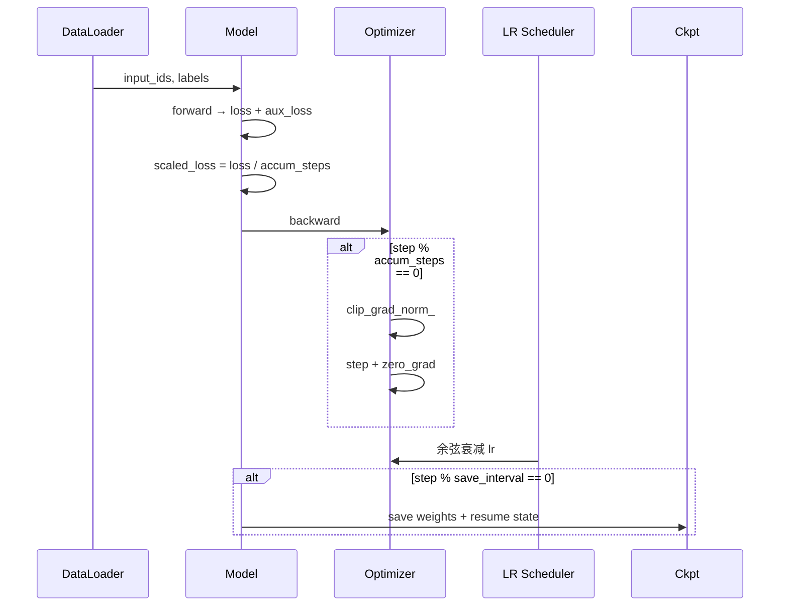

# 06 - 预训练与 SFT

> 对应代码：`trainer/train_pretrain.py`（454 行）+ `trainer/train_full_sft.py`（201 行）

## 6.1 两阶段定位

| 维度 | Pretrain | Full SFT |
|------|----------|----------|
| 目标 | 让模型学会语言建模（Next Token） | 让模型学会按 ChatML 对齐人类指令 |
| 数据 | 纯文本 `pretrain_t2t_mini.jsonl` | 多轮对话 `sft_t2t_mini.jsonl`（含 Tool Call） |
| Loss 区域 | 全部 token（除 padding） | 仅 assistant 区段 |
| 起点权重 | `none`（随机初始化） | `pretrain` |
| 学习率 | **5e-4**（高） | **1e-5**（低，避免灾难性遗忘） |
| 梯度累积 | 32 | 8 |
| 默认 max_seq_len | 340 | 768 |
| 推荐 epochs | 2 | 2 |

## 6.2 启动命令

```bash
# Pretrain（默认参数）
python trainer/train_pretrain.py \
    --hidden_size 512 --num_hidden_layers 8 \
    --batch_size 8 --epochs 2 \
    --data_path .dataset/pretrain_t2t_mini.jsonl

# Full SFT
python trainer/train_full_sft.py \
    --from_weight pretrain --save_weight full_sft \
    --batch_size 8 --epochs 2

# DDP 多卡（NCCL）
torchrun --nproc_per_node=8 trainer/train_pretrain.py [...args]
```

## 6.3 训练循环关键步骤



### 6.3.1 前向 + 损失

```python
res = model(input_ids, labels=labels)
loss = res.loss + res.aux_loss      # MoE 才有 aux_loss
scaled_loss = loss / args.accumulation_steps
```

### 6.3.2 梯度累积

每 `accumulation_steps` 步才真正更新一次参数，等价于把 batch 放大 `accumulation_steps` 倍：

```
effective_batch_size = batch_size × accumulation_steps × world_size
                     = 8 × 32 × 1 = 256 (单卡 Pretrain 默认)
```

### 6.3.3 梯度裁剪

```python
scaler.unscale_(optimizer)
torch.nn.utils.clip_grad_norm_(model.parameters(), args.grad_clip)  # 默认 1.0
scaler.step(optimizer); scaler.update()
optimizer.zero_grad(set_to_none=True)
```

### 6.3.4 学习率调度

`trainer_utils.get_lr` 是一个**无 warmup 的余弦退火**：

```
lr(t) = lr_init × (0.1 + 0.45 × (1 + cos(π × t / total_steps)))
```

- 起点：`lr_init`
- 终点：`0.1 × lr_init`（最低 10%）
- 形状：单峰余弦下降

## 6.4 Pretrain 的吞吐优化要点

`train_pretrain.py` 在工程上做了大量针对性优化：

| 优化项 | 实现位置 | 收益 |
|--------|---------|------|
| GPU loss 累加 | `running_loss_sum += loss.detach()` | 减少 GPU→CPU 同步 |
| 仅日志步 `.item()` | `is_log_step` 分支 | 大幅降低同步开销 |
| 提前打印 first batch | `first_step_logged` flag | 帮助定位 hang |
| 自动 ETA + tok/s | `make_progress_bar` + `format_duration` | 训练体感好 |
| TF32 + cuDNN benchmark | `torch.backends.cuda.matmul.allow_tf32 = True` | A100 上 ~30% 提升 |
| `expandable_segments` | `PYTORCH_CUDA_ALLOC_CONF` | 减少显存碎片 |
| MPS 数据零拷贝 | `train_ds = PretrainDataset(..., device=mps_device)` | Apple Silicon 推理 ~2× |
| MPS 关闭 SDPA/AMP | `lm_config.flash_attn = False` 等 | 避免 100× 反向慢 |

## 6.5 SFT 与 Pretrain 的差异

只在三处不同：

1. **数据集**：`SFTDataset` 而非 `PretrainDataset`，labels 只在 assistant 区段非 `-100`
2. **学习率**：1e-5（低 50×），避免破坏预训练知识
3. **起点权重**：`--from_weight pretrain`（自动加载 `out/pretrain_*.pth`）

其余的训练循环、混合精度、断点续训、wandb 集成完全复用 `trainer_utils`。

## 6.6 断点续训

通过 `--from_resume 1` 自动检测并恢复：

```bash
python trainer/train_pretrain.py --from_resume 1 [其它参数保持一致]
```

机制：
1. `lm_checkpoint(...)` 检测 `checkpoints/{weight}_{hidden}{_moe}_resume.pth`
2. `restore_training_state` 把 model / optimizer / scaler 全部恢复
3. `SkipBatchSampler(skip=start_step)` 在第一个 epoch 内跳过已训练 batch
4. wandb run 通过 `wandb_id` 续接，曲线连续

跨 GPU 数量也能续训：保存的 step 会乘以 `saved_world_size / current_world_size` 自动换算。详见 [14 - 训练工具链](./14-trainer-utils.md)。

## 6.7 SFT 数据中的 Tool Call 能力

MiniMind3 把 Tool Call 数据**直接混入** `sft_t2t / sft_t2t_mini` 主线数据集，因此 `full_sft` 之后模型即具备**基础 Tool Call 能力**，无需额外训练阶段。如需进一步强化，请使用 [11 - Agentic RL](./11-training-agent-rl.md)。

## 6.8 监控与可视化

| 工具 | 启用方式 |
|------|---------|
| WandB | `--use_wandb --wandb_project MiniMind-Pretrain` |
| TensorBoard | `--use_tb`，日志写入 `out/tb_logs/{ts}/` |
| SwanLab | 只需安装 `swanlab` 包，与 wandb API 完全兼容 |

记录的关键指标：`loss / avg_loss / logits_loss / aux_loss / learning_rate / tokens_per_sec / epoch_eta_min`。
