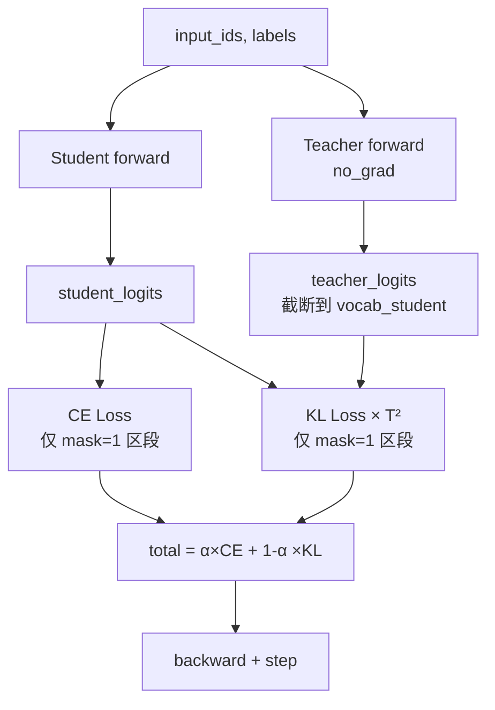

# 08 - 知识蒸馏：老师傅带徒弟的艺术

> 对应代码：`trainer/train_distillation.py`（328 行）

## 8.1 知识蒸馏基础：为什么小模型能学到大模型的智慧？

想象一下，一位经验丰富的老师傅在带徒弟。老师傅不仅告诉徒弟"这个零件应该这样装"（硬答案），还会分享他的判断思路："这里稍微紧一点更好，因为..."（软知识）。**知识蒸馏就是让大模型当老师傅，小模型当徒弟，学习的不只是答案，更是思考方式。**

传统训练只告诉模型"正确答案是 A"，但知识蒸馏让大模型输出更丰富的信息："A 有 80% 的把握，B 有 15% 的道理，C 也有 5% 的可能性"。这种**概率分布**就像老师傅的评分理由，包含了更多细微的判断逻辑——这就是所谓的"暗知识"（dark knowledge）。

MiniMind 实现了经典的 **logits 级蒸馏**（Hinton et al. 2015），核心公式如下：

```
total_loss = α × CE(student, gt) + (1-α) × KL(student || teacher) × T²
```

其中：
- `T` 是**温度**，像一个放大镜，温度越高，老师分享的细微判断越清晰可见
- `α` 平衡硬标签（标准答案）与软标签（老师的思路）的权重
- `T²` 是**补偿因子**，像音量平衡旋钮——放大细节的同时保持整体音量一致，确保梯度尺度稳定

## 8.2 MiniMind 蒸馏的支持场景：不同规模的"师徒配对"

知识蒸馏就像老师傅带徒弟，可以根据实际情况灵活配对。MiniMind 支持以下几种常见的"师徒组合"：

| 场景 | 学生（徒弟） | 教师（老师傅） |
|------|------|------|
| MoE → Dense | Dense `hidden=512, layers=8` | MoE `hidden=512, layers=8, experts=4` |
| 大 → 小（同结构） | `hidden=384` | `hidden=768` |
| 同尺寸自蒸馏 | `hidden=512` | `hidden=512`（不同 ckpt） |

通过 `--student_*` 与 `--teacher_*` 两组参数解耦学生与教师配置，就像可以分别设定徒弟的学习能力和老师傅的教学风格。

## 8.3 核心蒸馏损失实现：如何量化"学习思路"的效果？

要把老师傅的思路转化为可计算的数学公式，我们需要一个衡量标准。这段代码实现了核心的蒸馏损失计算：

```python
def distillation_loss(student_logits, teacher_logits, temperature=1.0,
                      reduction='batchmean'):
    with torch.no_grad():
        teacher_probs = F.softmax(teacher_logits / temperature, dim=-1).detach()
    student_log_probs = F.log_softmax(student_logits / temperature, dim=-1)
    kl = F.kl_div(student_log_probs, teacher_probs, reduction=reduction)
    return (temperature ** 2) * kl
```

**关键点解析：**
- 教师用 `softmax + detach`：老师傅的判断是固定的参考标准，不参与梯度更新（不跟着徒弟一起学）
- 学生用 `log_softmax`：徒弟需要调整自己的输出去靠近老师
- `F.kl_div` 期望 input 是 log 空间、target 是概率空间：这是 KL 散度的数学要求
- 最后乘 `T²` 是 Hinton 论文的标准做法：就像音量平衡旋钮，放大细节的同时保持整体稳定

## 8.4 训练循环：师徒协作的完整流程

整个蒸馏过程就像老师傅手把手教徒弟，从输入到输出形成完整的闭环：



### 8.4.1 词表对齐：确保师徒"语言相通"

如果学生和教师的 `vocab_size` 不一致，需要**截断教师 logits**，确保两者在同一个词汇空间对话：

```python
vocab_size_student = student_logits.size(-1)
teacher_logits = teacher_logits[..., :vocab_size_student]
```

MiniMind3 学生与教师都用同一个 tokenizer（vocab=6400），因此该截断通常不触发——就像师徒俩说同一种方言，沟通无障碍。

### 8.4.2 仅在 mask=1 处计算 KL：只在学习区段传授经验

由于 SFT 数据中 system / user 区段 labels 为 `-100`，这些位置不应该参与蒸馏——就像老师傅只在徒弟实际操作时才指导，不会在闲聊时强行教学：

```python
loss_mask = (labels[..., 1:] != -100).float()
loss_mask_flat = loss_mask.view(-1)

distill_loss = distillation_loss(
    student_logits.view(-1, V)[loss_mask_flat == 1],
    teacher_logits.view(-1, V)[loss_mask_flat == 1],
    temperature=temperature)
```

## 8.5 默认超参：调优"教学节奏"的关键旋钮

蒸馏训练的效果很大程度上取决于超参数的设置，就像老师傅需要根据徒弟的接受能力调整教学节奏：

| 参数 | 默认 | 说明 |
|------|------|------|
| `--alpha` | 0.5 | CE 与 KL 各占一半：既学标准答案，也学老师思路 |
| `--temperature` | 1.5 | 适度软化（推荐范围 1.0~2.0）：放大镜倍数适中，既能看清细节又不至于失真 |
| `--learning_rate` | 5e-6 | 比 SFT 还低，避免遗忘：徒弟要慢慢消化老师的经验，不能操之过急 |
| `--accumulation_steps` | 16 | 较大有效 batch 提升稳定性：多看几个例子再总结规律，学习更稳健 |
| `--epochs` | 6 | 蒸馏需要更多 epoch：师傅领进门，修行靠个人，多练几轮才能融会贯通 |

## 8.6 启动命令：开始你的"师徒传承"之旅

准备好让大模型当老师傅、小模型当徒弟了吗?使用以下命令开启蒸馏训练:

```bash
# MoE 教师 → Dense 学生:让多专家系统教导单一模型
python trainer/train_distillation.py \
    --student_hidden_size 512 --student_num_layers 8 --student_use_moe 0 \
    --teacher_hidden_size 512 --teacher_num_layers 8 --teacher_use_moe 1 \
    --from_student_weight full_sft \
    --from_teacher_weight full_sft \
    --alpha 0.5 --temperature 1.5

# 大模型 → 小模型:资深专家带新人
python trainer/train_distillation.py \
    --student_hidden_size 384 --student_num_layers 6 \
    --teacher_hidden_size 768 --teacher_num_layers
```

**温馨提示:** 就像真正的师徒关系,蒸馏需要耐心和时间。选择合适的温度(放大镜倍数)和 alpha(学习与模仿的平衡),让你的小模型真正继承大模型的智慧!
