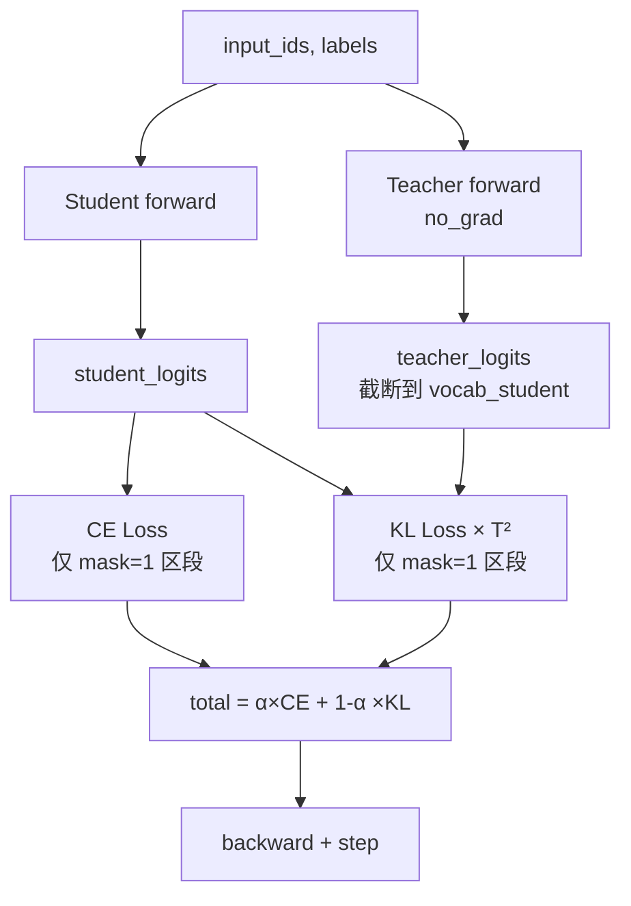

# 08 - 知识蒸馏

> 对应代码：`trainer/train_distillation.py`（328 行）

## 8.1 知识蒸馏基础

知识蒸馏（Knowledge Distillation, KD）通过让**学生模型**模仿**教师模型**的输出概率分布，把教师的"暗知识"转移给学生。MiniMind 实现了经典的 **logits 级蒸馏**（Hinton et al. 2015）：

```
total_loss = α × CE(student, gt) + (1-α) × KL(student || teacher) × T²
```

其中：
- `T` 是温度，软化概率分布
- `α` 平衡硬标签 CE 与软标签 KL 的权重
- `T²` 是补偿因子，保持 KL 项的梯度尺度

## 8.2 MiniMind 蒸馏的支持场景

| 场景 | 学生 | 教师 |
|------|------|------|
| MoE → Dense | Dense `hidden=512, layers=8` | MoE `hidden=512, layers=8, experts=4` |
| 大 → 小（同结构） | `hidden=384` | `hidden=768` |
| 同尺寸自蒸馏 | `hidden=512` | `hidden=512`（不同 ckpt） |

通过 `--student_*` 与 `--teacher_*` 两组参数解耦学生与教师配置。

## 8.3 核心蒸馏损失实现

```python
def distillation_loss(student_logits, teacher_logits, temperature=1.0,
                      reduction='batchmean'):
    with torch.no_grad():
        teacher_probs = F.softmax(teacher_logits / temperature, dim=-1).detach()
    student_log_probs = F.log_softmax(student_logits / temperature, dim=-1)
    kl = F.kl_div(student_log_probs, teacher_probs, reduction=reduction)
    return (temperature ** 2) * kl
```

注意：
- 教师用 `softmax + detach`，学生用 `log_softmax`
- `F.kl_div` 期望 input 是 log 空间、target 是概率空间
- 最后乘 `T²` 是 Hinton 论文的标准做法

## 8.4 训练循环



### 8.4.1 词表对齐

如果学生和教师的 `vocab_size` 不一致，**截断教师 logits**：

```python
vocab_size_student = student_logits.size(-1)
teacher_logits = teacher_logits[..., :vocab_size_student]
```

MiniMind3 学生与教师都用同一个 tokenizer（vocab=6400），因此该截断通常不触发。

### 8.4.2 仅在 mask=1 处计算 KL

由于 SFT 数据中 system / user 区段 labels 为 `-100`，这些位置不应该参与蒸馏：

```python
loss_mask = (labels[..., 1:] != -100).float()
loss_mask_flat = loss_mask.view(-1)

distill_loss = distillation_loss(
    student_logits.view(-1, V)[loss_mask_flat == 1],
    teacher_logits.view(-1, V)[loss_mask_flat == 1],
    temperature=temperature)
```

## 8.5 默认超参

| 参数 | 默认 | 说明 |
|------|------|------|
| `--alpha` | 0.5 | CE 与 KL 各占一半 |
| `--temperature` | 1.5 | 适度软化（推荐范围 1.0~2.0） |
| `--learning_rate` | 5e-6 | 比 SFT 还低，避免遗忘 |
| `--accumulation_steps` | 16 | 较大有效 batch 提升稳定性 |
| `--epochs` | 6 | 蒸馏需要更多 epoch |

## 8.6 启动命令

```bash
# MoE 教师 → Dense 学生
python trainer/train_distillation.py \
    --student_hidden_size 512 --student_num_layers 8 --student_use_moe 0 \
    --teacher_hidden_size 512 --teacher_num_layers 8 --teacher_use_moe 1 \
    --from_student_weight full_sft \
    --from_teacher_weight full_sft \
    --alpha 0.5 --temperature 1.5

# 大模型 → 小模型
python trainer/train_distillation.py \
    --student_hidden_size 384 --student_num_layers 6 \
    --teacher_hidden_size 768 --teacher_num_layers