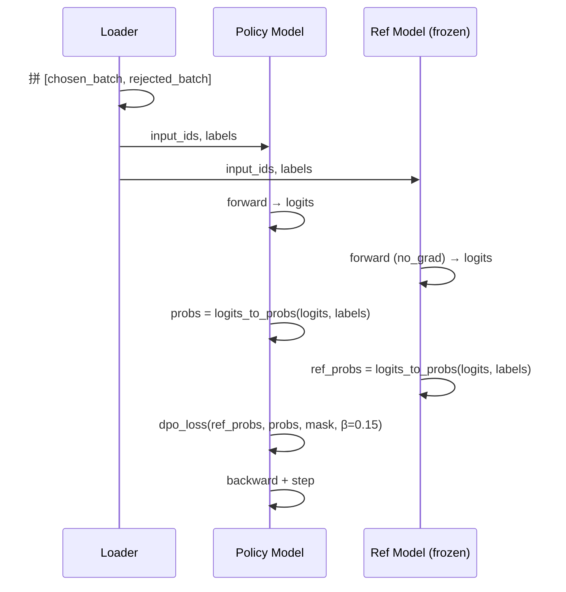

# 09 - DPO 偏好对齐：直接用"哪个更好"来训练

> 对应代码：`trainer/train_dpo.py`（297 行）+ `dataset/lm_dataset.py:DPODataset`

## 9.1 DPO 简介：像训练品酒师一样学习偏好

想象你在训练一位**品酒师**。传统方法（RLHF）需要先让品酒师给每杯酒打分，建立一套评分标准（Reward Model），然后再用这套标准去指导他。但 DPO 的做法更直接：**不需要先让他学会评分，而是直接给他两杯酒，问他"哪杯更好"**。通过反复回答这类问题，品酒师自然就学会了辨别优劣。

DPO（Direct Preference Optimization, Rafailov et al. 2023）就是这种思路的工程实现——它是 RLHF 的轻量级替代方案：**不需要 Reward Model、不需要 PPO 采样**，直接用偏好对 `(prompt, chosen, rejected)` 在 supervised 设置下优化策略。

核心损失公式：

```
L_DPO = -log σ(β × [log π(y_w|x)/π_ref(y_w|x) - log π(y_l|x)/π_ref(y_l|x)])
```

直观理解：让 chosen 的概率比相对参考模型上升、rejected 的概率比下降。这里的 **Reference Model 就像"起跑线"**——它记录了你初始的状态，训练过程中会不断对比"比起跑线进步了多少"。而 **beta 参数则是"缰绳的长度"**——控制模型能离参考走多远，太短学不到东西，太长可能跑偏。

**为什么 DPO 不需要单独的奖励模型？** 因为它的损失函数已经从理论上证明了：只要你有偏好数据（哪个更好），就可以直接从这些偏好中反推出最优的策略更新方向，完全绕过了"先学评分再优化"这个中间环节。这就是 DPO 的核心价值——**把两步合成一步，既省资源又稳定**。

## 9.2 数据格式

`DPODataset` 期望每条样本包含 `chosen` 与 `rejected` 两个对话列表：

```json
{
  "chosen":   [{"role":"user","content":"Q"},{"role":"assistant","content":"好答案"}],
  "rejected": [{"role":"user","content":"Q"},{"role":"assistant","content":"差答案"}]
}
```

预处理逻辑（与 SFT 一致）：
- 应用 ChatML template
- 通过 `_sft_generate_labels` 只保留 assistant 区段为可学习
- 一次 batch 同时返回 chosen / rejected 的 `input_ids` 与 `labels`

## 9.3 DPO Loss 实现

`trainer/train_dpo.py:dpo_loss` 的核心：

```python
def logits_to_probs(logits, labels):
    log_probs = F.log_softmax(logits, dim=-1)
    # gather 出 label 位置的 log prob，并按 mask 求和
    probs = torch.gather(log_probs, dim=-1, index=labels.unsqueeze(-1)).squeeze(-1)
    return probs

def dpo_loss(ref_probs, probs, mask, beta):
    # 长度归一：每条样本求平均 log prob
    seq_lengths = mask.sum(dim=1, keepdim=True)
    ref_probs = (ref_probs * mask).sum(dim=1) / seq_lengths.squeeze()
    probs     = (probs     * mask).sum(dim=1) / seq_lengths.squeeze()
    # 拆 chosen / rejected
    bsz = ref_probs.shape[0] // 2
    chosen_ref,   reject_ref   = ref_probs[:bsz], ref_probs[bsz:]
    chosen_probs, reject_probs = probs[:bsz],     probs[bsz:]
    # DPO logits = β × (策略相对参考的优势差)
    pi_logratios  = chosen_probs - reject_probs
    ref_logratios = chosen_ref   - reject_ref
    logits = beta * (pi_logratios - ref_logratios)
    return -F.logsigmoid(logits).mean()
```

注意点：
1. **长度归一**：避免长答案天然得分高
2. **mask 过滤**：只在 assistant 区段计算 log prob
3. **β（beta）**：控制策略偏离参考的强度，**默认 0.15**（偏小，更稳）

## 9.4 训练流程：双模型协作



### 关键点

- **Reference Model 必须冻结**：复制一份 `full_sft` 权重，加载后 `eval()` + `requires_grad=False`
- **DDP 下双模型**：注意显存约为 SFT 的 **2 倍**
- **batch 内 chosen/rejected 拼接**：从 Dataset 出来时已经拼好，模型只前向一次

## 9.5 启动命令

```bash
python trainer/train_dpo.py \
    --from_weight full_sft \
    --save_weight rlhf \
    --data_path .dataset/dpo.jsonl \
    --learning_rate 1e-8 \
    --batch_size 4 --epochs 2 --beta 0.15
```

> ⚠️ **学习率必须极小**（默认 1e-8）。DPO 对学习率非常敏感，过大会导致 reward hacking 或模式崩塌。

## 9.6 监控指标

`train_dpo.py` 在日志中输出：

| 指标 | 含义 |
|------|------|
| `loss` | DPO 损失，应缓慢下降 |
| `chosen_reward` | `β × (chosen_logprob - chosen_ref_logprob)` 的均值 |
| `reject_reward` | 同上，rejected 的 |
| `reward_margin` | chosen - reject，反映偏好分离度 |
| `reward_acc` | `chosen_reward > reject_reward` 的比例（训练准确率） |

健康训练曲线：
- `loss` 平滑下降
- `reward_margin` 持续 > 0 且缓慢扩大
- `reward_acc` 应稳定 > 0.6

## 9.7 DPO vs RLAIF：什么时候用哪个？

| 维度 | DPO | RLAIF (PPO/GRPO) |
|------|-----|-----------------|
| 是否需要 RM | ❌ | ✅ 显式或基于规则 |
| 采样开销 | 0（离线数据） | 高（每步要 rollout） |
| 训练稳定性 | 高 | 中 |
| 对 OOD prompt 的探索 | 差 | 强 |
| 显存占用 | 2× （Policy+Ref） | 3-4× （+ Critic / Reward） |

**MiniMind3 的推荐链路**：先 DPO 做"对齐基线"，再 RLAIF 做能力强化。

## 9.8 DPO 的本质：从 RLHF 反推出的最优解

```
RLHF: SFT → Reward Model → PPO
DPO:  SFT → DPO（直接用偏好数据，跳过 RM 与 PPO）
```

DPO 的损失函数实际上是从 PPO 的最优解 **反推**出的封闭形式，理论上等价但数值上更稳定，是当前业界事实上的"轻量对齐首选"。
