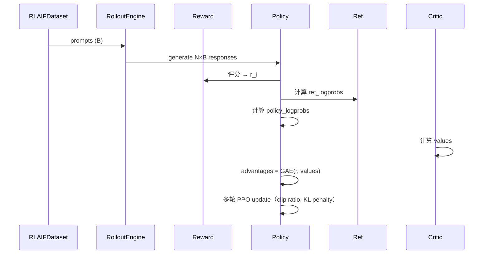

# 10 - RLAIF：PPO / GRPO / CISPO

> 对应代码：`trainer/train_ppo.py` / `trainer/train_grpo.py` + `trainer/rollout_engine.py` + `trainer/reward_utils.py` + `dataset/lm_dataset.py:RLAIFDataset`

## 10.1 RLAIF 在 MiniMind3 中的定位

RLAIF（Reinforcement Learning from AI Feedback）泛指**用规则或 AI 模型作为 Reward 信号**进行 RL 训练。MiniMind3 内置了三种主流策略：

| 算法 | 核心思想 | 适用场景 | 是否需要 Critic |
|------|---------|---------|----------------|
| **PPO** | Actor-Critic + clipped surrogate | 通用 RLHF | ✅ |
| **GRPO** | 组内归一化 advantage，无 Critic | 推理类任务（数学/代码） | ❌ |
| **CISPO** | Clipped Importance Sampling Policy Optimization | 长序列稳定训练 | ❌ |

> 三者共享一套 Rollout Engine 与 Reward Utils，只在 loss 与 advantage 计算上不同。

## 10.2 公共组件：Rollout Engine

`trainer/rollout_engine.py` 负责"用当前策略对 prompts 批量生成 N 条 response"，接近一个轻量级的 mini-vllm：

```python
class RolloutEngine:
    def generate(self, prompts: List[str],
                 num_samples_per_prompt: int = 4,
                 max_new_tokens: int = 512,
                 temperature: float = 1.0,
                 top_p: float = 0.9) -> List[List[str]]:
        ...
```

实现要点：
1. **批量复制 prompt**：每个 prompt 复制 N 份送入 model.generate
2. **KV-cache 复用**：调用 transformers 原生 generate
3. **EOS 提前停止**：遇到 `<|im_end|>` 立即停
4. **temperature/top_p 解耦**：训练时用较高温度增强探索

## 10.3 Reward Utils

`trainer/reward_utils.py` 提供多种打分函数：

| 函数 | 用途 | 返回 |
|------|------|------|
| `format_reward` | 是否按 ChatML 完整闭合 `<\|im_end\|>` | 0 / 1 |
| `length_reward` | 长度是否在合理区间（避免一直输出短文本） | 0~1 |
| `math_correctness_reward` | GSM8K 风格数学题正确性 | 0 / 1 |
| `boxed_answer_reward` | 检查 `\boxed{...}` 是否匹配 GT | 0 / 1 |
| `tool_call_format_reward` | Tool Call JSON 是否合法 | 0 / 1 |
| `compose_rewards(*funcs, weights)` | 加权组合多个 reward | float |

`parse_messages_from_chat_prompt` 可把 ChatML 字符串解回消息列表，便于后续打分。

## 10.4 PPO 实现（`trainer/train_ppo.py`）

### 10.4.1 Actor-Critic 结构

```
Policy Model (Actor)  : 复用 MiniMind 主模型
Reference Model       : Policy 的快照，冻结
Critic (Value Head)   : 在 Policy 顶部加 Linear(hidden_size, 1)
```

### 10.4.2 训练循环



### 10.4.3 PPO 损失

```python
ratio = exp(new_logp - old_logp)
surr1 = ratio * advantages
surr2 = clip(ratio, 1-ε, 1+ε) * advantages
policy_loss = -min(surr1, surr2).mean()
value_loss  = (returns - values).pow(2).mean()
kl_penalty  = β_kl * KL(policy || ref)
total = policy_loss + c_v * value_loss + kl_penalty
```

关键超参：
- `clip_eps = 0.2`
- `kl_coef = 0.05`（自适应可选）
- `ppo_epochs = 4`（每批 rollout 重用 4 次）

## 10.5 GRPO 实现（`trainer/train_grpo.py`）

GRPO（Group Relative Policy Optimization, DeepSeek-R1 风格）**去掉 Critic**，改用同 prompt 下 N 个 response 的 reward 组内归一化作为 advantage：

```python
# 对每个 prompt 的 N 条 response 分组
group_rewards = rewards.view(B, N)
# 组内 z-score
adv = (group_rewards - group_rewards.mean(1, keepdim=True)) \
      / (group_rewards.std(1, keepdim=True) + 1e-8)
adv = adv.view(-1)
```

损失与 PPO 类似但无 value_loss：

```python
ratio = exp(new_logp - old_logp)
surr1 = ratio * adv
surr2 = clip(ratio, 1-ε, 1+ε) * adv
loss = -min(surr1, surr2).mean() + β_kl * KL(policy || ref)
```

**优势**：
- 显存少 1 份模型（无 Critic）
- 不依赖 value 估计准确性
- 在数学/代码这类**有明确 0/1 reward**的任务上表现极好

## 10.6 CISPO（Clipped Importance Sampling）

CISPO 是 GRPO 的改良，针对长序列重要性采样比的方差爆炸问题：

```python
# 关键差异：在 token 级而非序列级 clip
log_ratio = new_logp - old_logp.detach()       # [B, T]
ratio = exp(log_ratio.clamp(-clip_log, clip_log))  # 先在 log 空间 clamp
surr = ratio * adv.unsqueeze(-1)               # broadcast 到每个 token
loss = -(surr * mask).sum() / mask.sum()
```

**优势**：
- 长序列下不会因为某几个 token 概率剧烈变化而拒绝整条样本
- 在 reasoning trace 较长（>1k tokens）时比 GRPO 稳定

## 10.7 数据集：`RLAIFDataset`

```json
{
  "messages": [
    {"role":"user","content":"求 2x+3=11 的解"}
  ],
  "answer": "4"   // 用于规则 reward 计算
}
```

`__getitem__` 仅返回 prompt 与 ground truth，不返回 response（response 在训练时实时 rollout 生成）。

## 10.8 启动命令

```bash
# GRPO（推荐起步）
python trainer/train_grpo.py \
    --from_weight rlhf \
    --save_weight reason \
    --data_path .dataset/rlaif_math.jsonl \
    --num_samples_per_prompt 8 \
    --learning_rate 5e-7 --kl_coef 0.04

# PPO
python trainer/train_ppo.py \
    --from_weight rlhf \
    --save_weight reason \
    --learning_rate 5e-7 --kl_coef 0.05 --ppo_epochs 4

# CISPO（长 trace 任务）
python trainer/train_grpo.py --algo cispo \
    --max_new_tokens 2048 --clip_log 0.4
```

## 10.9 训练监控

| 指标 | 健康区间 |
|------|---------|
| `mean_reward` | 稳定上升 |
| `kl(policy ‖ ref)` | < 0.05（过大说明偏离过远） |
| `response_length` | 平稳，不暴涨/坍缩 |
| `clip_frac` | 0.05~0.20 |
| `entropy` | 缓慢下降但 > 0.5（避免坍缩到单一答案） |

## 10.10 常见坑

1. **Reward hacking**：模型学会输出特定 pattern 骗 reward → 加 `format_reward + length_reward` 约束
2. **KL 爆炸**：一两步内训练崩溃 → 降低 lr 至 1e-7、提高 kl_coef
3. **Mode collapse**：N 条 response 完全一致 → 提高 temperature、降低 top_p、加 entropy bonus
4. **OOM**：rollout 时 batch×N 太大 → 分 micro-batch 累计
