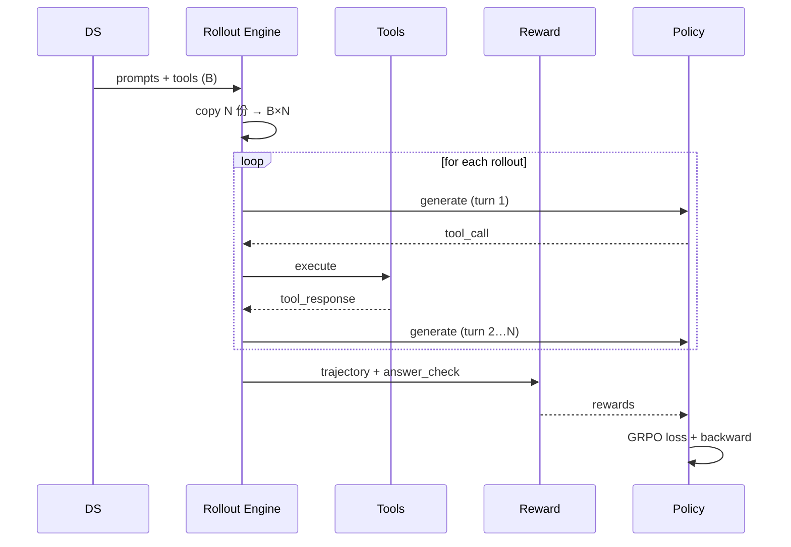

# 11 - Agentic RL（教孩子用工具解决问题）

> 对应代码：`trainer/train_agent.py` + `dataset/lm_dataset.py:AgentRLDataset` + `trainer/rollout_engine.py`（多轮分支）

## 11.1 为什么普通对话不够？——从「背答案」到「学会用工具」

想象一下：你问一个孩子"北京和上海今天的天气怎么样？"

**普通对话模型**就像一个只会背书的孩子——他只能凭记忆给出一个固定答案，如果记错了就彻底错。

**Agentic RL** 则是教孩子学会使用工具：给他计算器查数学题、给他字典查生词、给他搜索引擎查实时信息。孩子不再依赖死记硬背，而是掌握了一套**解决问题的方法论**。

MiniMind3 的 Agentic RL 就是让模型从「一次性回答」进化到「多轮工具调用」：

```
Step 0: model 生成 → <tool_call>{...}</tool_call>
Step 1: 工具执行 → <tool_response>{...}</tool_response>  注入 prompt
Step 2: model 生成 → 可能继续 tool_call 或最终回答
...
Step N: model 输出最终答案 → reward
```

整条轨迹共享同一个 reward，反向传播只在 **assistant 生成的 token** 上回传。

## 11.2 数据集设计——给孩子的「考题」和「评分标准」

要让模型学会使用工具，我们需要准备特殊的训练数据。每条数据就像一份**开卷考试的考题**：

```json
{
  "messages": [
    {"role": "system", "content": "你可以调用以下工具…"},
    {"role": "user", "content": "查询北京和上海的天气，对比"}
  ],
  "tools": [
    {"type":"function","function":{"name":"get_weather", "parameters":{...}}}
  ],
  "answer_check": {
    "type": "regex",
    "pattern": "北京.*?\\d+°C.*?上海.*?\\d+°C"
  }
}
```

字段说明：
- `messages` + `tools`：构成初始 prompt（考题 + 允许使用的工具清单）
- `answer_check`：用于轨迹完成后判定 reward（评分标准——答案是否符合要求）

## 11.3 多轮 Rollout——「开卷考试」的答题过程

`RolloutEngine` 在 Agent 模式下进入循环，就像孩子在开卷考试中可以多次查阅资料、使用工具：

```python
def agent_rollout(prompt, tools, max_turns=6):
    history = prompt
    trajectory = []
    for turn in range(max_turns):
        out = model.generate(history)
        trajectory.append(out)
        if "<tool_call>" in out:
            tool_result = execute_tool(parse_tool_call(out), tools)
            history = history + out + render_tool_response(tool_result)
        else:
            break  # 最终回答
    return history, trajectory
```

### 工具执行——给孩子的「工具箱」

`trainer/train_agent.py` 提供本地 tool dispatch 表（mock + sandbox），就像给孩子准备了一个工具箱：

```python
TOOL_REGISTRY = {
    "get_weather": mock_get_weather,
    "calculator":  safe_eval,
    "search":      mock_search,
    ...
}
```

支持注册自定义 Python 函数，签名约定 `def tool(**kwargs) -> str`。

## 11.4 Reward 设计——「考试评分标准」

Agentic 任务的 reward 是**多目标加权**，就像老师批改开卷考试时的评分标准：

| 子 reward | 权重 | 说明 |
|----------|------|------|
| `task_success` | 1.0 | 最终答案是否正确（regex / exact_match）——答对得大分 |
| `tool_call_format` | 0.2 | tool_call JSON 是否合法——格式规范得小分 |
| `tool_call_efficiency` | 0.1 | 是否在最少步数内完成——效率高加分 |
| `format_reward` | 0.1 | ChatML 闭合性——卷面整洁加分 |
| `length_penalty` | -0.05 | 过长惩罚——啰嗦扣分 |

**注**：task_success 占主导，其它都是 shaping reward（辅助引导）。

## 11.5 Loss 计算（Token-Level Mask）——只评价孩子的思考过程

由于轨迹中既有 assistant 生成的 token（孩子的思考），也有工具响应注入的 token（查到的资料），**只能在 assistant 区段反传梯度**——老师只评价孩子的思考过程，不评价字典里的内容：

```python
# 标记每个 token 是否由 policy 生成
loss_mask = torch.zeros_like(input_ids)
for assistant_span in find_assistant_spans(input_ids):
    loss_mask[assistant_span.start : assistant_span.end] = 1

# GRPO loss
adv = group_normalize(rewards)
log_ratio = (new_logp - old_logp.detach()) * loss_mask
ratio = exp(log_ratio.clamp(-clip_log, clip_log))
loss = -(ratio * adv.unsqueeze(-1) * loss_mask).sum() / loss_mask.sum()
```

## 11.6 训练循环——完整的「教学流程」



## 11.7 启动命令——开始「教学」

```bash
python trainer/train_agent.py \
    --from_weight reason \
    --save_weight agent \
    --data_path .dataset/agent_rl.jsonl \
    --num_samples_per_prompt 8 \
    --max_turns 6 \
    --learning_rate 3e-7 \
    --kl_coef 0.04
```

## 11.8 调试技巧——「教学经验」总结

- **先离线验证 reward 函数**：构造若干 (trajectory, expected_reward) 单元测试——先模拟批改几份试卷，确保评分标准合理
- **从短 max_turns 起步**：先 max_turns=2 收敛后再放开——先让孩子做简单题，再逐步增加难度
- **冷启动配方**：建议 `pretrain → SFT → DPO → GRPO → Agent RL`，跳级容易崩——循序渐进，别想一口吃成胖子
- **温度调度**：训练前期 T=1.0~1.2，后期降到 0.7——前期鼓励探索，后期稳定发挥
- **Tool 失败 fallback**：工具异常返回 `<tool_response>{"error": "..."}` 而非中断 rollout——工具坏了就告诉孩子"查不到"，而不是直接取消考试

## 11.9 已知限制——当前「教学环境」的局限

1. **本地 tool sandbox 简化**：`safe_eval` 仅支持基础数学，不支持文件 IO/网络——工具箱里的工具还不够丰富
2. **多轮 rollout 显存大**：建议 `num_samples_per_prompt ≤ 4`——同时辅导太多孩子会累
3. **没有 retrieval-augmented**：未集成 vector DB，需自行扩展工具——还没配备智能搜索引擎
4. **不支持并行多 agent**：单进程串行执行 tool——一次只能辅导一个孩子

## 11.10 与业界框架对比——其他「教学方法」参考

就像教育孩子有多种教学方法一样，业界也有不同的 Agent 框架：

| 框架 | 特性 | MiniMind 对应 |
|------|------|--------------|
| OpenAI Function Calling | API 级工具调用规范 | ChatML `<tool_call>` 标签 |
| LangGraph | 状态机调度 | RolloutEngine 内联循环 |
| AutoGPT / ReAct | 思考-行动循环 | `<think>` + `<tool_call>` 多轮循环 |
| Toolformer | 模型自学何时调工具 | RL reward 引导工具调用时机 |
