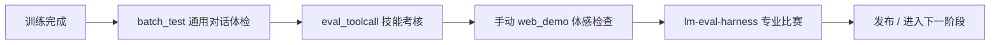

# 13 - 评测体系：给模型做「体检」

> 对应代码：`eval_llm.py` + `scripts/eval_toolcall.py` + `tests/test_trainer_utils.py`

## 13.1 评测策略：实用导向的体检方案

MiniMind3 作为**学习导向**的小模型项目，没有强行追求 Open LLM Leaderboard 等重量级 benchmark，而是聚焦**实用性 + 可解释性**。就像定期体检一样，我们关注的是模型的各项健康指标是否正常，而不是去和职业运动员比体能极限。

| 体检项目 | 检测工具 | 检测样本 |
|---------|------|------|
| 通用对话能力 | `eval_llm.py` 交互/批测 | 自定义问题集 |
| Tool Call 技能考核 | `scripts/eval_toolcall.py` | 内置工具用例 |
| 工程正确性检查 | `tests/test_trainer_utils.py` | pytest |
| 生命体征监测 | wandb / tensorboard | 训练日志 |

> 对于 C-Eval / MMLU / HumanEval 这类 academic benchmark，建议使用 **HuggingFace lm-eval-harness** 配合 `convert_model.py --to_hf` 后接入。这相当于去参加专业运动会，需要额外准备。

## 13.2 通用对话评测：`eval_llm.py --batch_test`

### 13.2.1 体检样本准备

`eval/test_questions.jsonl`（项目自定义）：

```json
{"question": "请用一句话解释什么是黑洞？"}
{"question": "中国的四大发明是？"}
{"question": "写一首关于春天的五言绝句"}
```

这些样本就像体检时的各项检查项目，覆盖了知识问答、文化常识、创意写作等不同维度。

### 13.2.2 启动体检

```bash
python eval_llm.py \
    --weight full_sft --hidden_size 512 \
    --batch_test --test_file ./eval/test_questions.jsonl \
    --temperature 0.7 --top_p 0.9
```

### 13.2.3 体检报告输出

`./eval/results_{timestamp}.jsonl`：

```json
{"question": "...", "answer": "...", "latency_ms": 1234, "tokens": 89}
```

这份报告记录了每个问题的回答内容、响应时间和生成 token 数。你可以直接对比不同 checkpoint 的回答质量，就像对比两次体检的各项指标变化。

## 13.3 Tool Call 评测：`scripts/eval_toolcall.py`

### 13.3.1 技能考核范围

Tool Call 能力就像模型掌握的实用技能，我们需要通过技能考核来验证它是否真的学会了：

- **Format**：tool_call JSON 格式是否规范合法
- **Selection**：面对不同任务时，是否能选择正确的工具
- **Argument**：调用工具时传递的参数是否正确（包括必填项）
- **Multi-turn**：拿到工具返回结果后，能否继续推理并完成后续任务

### 13.3.2 内置考核用例

```python
TEST_CASES = [
    {
        "user": "查一下北京今天的天气",
        "tools": [WEATHER_TOOL],
        "expected_tool": "get_weather",
        "expected_args": {"location": "北京"}
    },
    {
        "user": "1234*5678 等于多少？",
        "tools": [CALCULATOR_TOOL],
        "expected_tool": "calculator",
        "expected_args_check": lambda args: "1234" in args["expression"]
    },
    ...
]
```

这些用例覆盖了常见的生活场景和计算任务，就像驾照考试中的科目二、科目三。

### 13.3.3 启动技能考核

```bash
python scripts/eval_toolcall.py --weight agent --hidden_size 512
```

输出示例：

```
Format Pass:    19/20  (95.0%)
Selection Pass: 17/20  (85.0%)
Argument Pass:  16/20  (80.0%)
Overall Score:  86.7%
```

这份成绩单告诉你模型在各项技能上的掌握程度，方便针对性改进。

## 13.4 工程单元测试：`tests/test_trainer_utils.py`

```bash
pytest tests/test_trainer_utils.py -v
```

这是 MiniMind3 唯一的 unit test 文件，就像体检中心的设备校准检查，确保所有训练工具都能正常工作。覆盖核心训练工具：
- `get_lr`：学习率调度曲线是否正确
- `format_duration`：人类可读时间格式转换
- `get_model_params`：参数量统计准确性
- `SkipBatchSampler`：断点续训跳过逻辑
- `restore_training_state`：状态恢复正确性
- `lm_checkpoint`：路径生成规则

这体现了"工具链需要可靠，业务逻辑可手测"的取舍——基础设施必须经过严格测试，而模型行为可以通过实际运行来验证。

## 13.5 训练期生命体征监测

就像医院里的监护仪实时显示病人的心率、血压一样，训练过程中的各项指标能告诉你模型是否"健康"。详见各训练章节，关键指标汇总：

### 13.5.1 通用生命体征

| 指标 | 含义 | 健康范围 |
|------|------|---------|
| `loss` | 当前 batch 损失 | 平滑下降，无剧烈波动 |
| `avg_loss` | 滑动平均损失 | 整体趋势向下 |
| `learning_rate` | 当前学习率 | 按余弦曲线平稳下降 |
| `tokens_per_sec` | 训练吞吐速度 | 越高越好，反映硬件利用率 |
| `epoch_eta_min` | 当前 epoch 剩余分钟 | 反映训练节奏是否正常 |

### 13.5.2 MoE 专用指标

| 指标 | 含义 |
|------|------|
| `aux_loss` | 负载均衡损失，确保各专家被均匀使用 |
| `expert_load_std` | 各专家负载标准差（需自行打日志），越低说明负载越均衡 |

### 13.5.3 RL 专用指标

| 指标 | 含义 |
|------|------|
| `mean_reward` | 一批 rollout 的平均奖励分数 |
| `kl_div` | policy 与参考模型的 KL 散度，防止偏离太远 |
| `clip_frac` | PPO clip 触发比例，反映梯度裁剪频率 |
| `response_length` | 平均生成长度 |
| `reward_acc` (DPO) | chosen > rejected 的比例，越高说明偏好对齐越好 |

这些指标就像心电图，出现异常波动时需要及时调整超参数或检查数据质量。

## 13.6 经验性效果对比

> 以下为社区报告的近似值，仅供参考，不代表精确数字。就像不同人的体检报告各有特点，这里展示的是模型在不同能力维度上的相对表现。

| 模型 | 中文理解 | 英文理解 | Code | Math | Tool Call |
|------|---------|---------|------|------|----------|
| MiniMind3-Pretrain | ★ | ★ | × | × | × |
| MiniMind3-SFT | ★★★ | ★★ | ★ | ★ | ★★ |
| MiniMind3-DPO | ★★★ | ★★ | ★ | ★ | ★★ |
| MiniMind3-GRPO | ★★★ | ★★ | ★★ | ★★★ | ★★ |
| MiniMind3-Agent | ★★★ | ★★ | ★★ | ★★★ | ★★★ |
| MoE-A64M-Full-SFT | ★★★ | ★★★ | ★★ | ★★ | ★★ |

## 13.7 与官方 benchmark 接入

如果你想参加"专业运动会"（即官方学术评测），可以按以下步骤操作：

```bash
# 1. 转 HF 格式（相当于报名参赛前的资格认证）
python scripts/convert_model.py --to_hf \
    --weight full_sft --output_dir ./hf_minimind

# 2. 运行 lm-eval（正式比赛）
lm_eval --model hf \
        --model_args pretrained=./hf_minimind \
        --tasks ceval-valid,mmlu,gsm8k \
        --batch_size 8
```

这样就能在 C-Eval、MMLU、GSM8K 等标准赛道上与其他模型同台竞技。

## 13.8 推荐评测流程



就像完整的体检流程：先做基础检查（通用对话），再测专项技能（Tool Call），然后医生面诊（手动体验），最后有需要的话参加专业赛事（官方 benchmark）。每一步都确认健康，才能放心进入下一个训练阶段。
