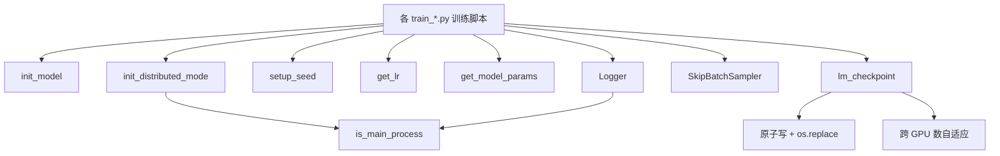

# 14 - 训练工具链：分布式 / 混合精度 / 断点续训

> 对应代码：`trainer/trainer_utils.py`

## 14.1 概览

`trainer_utils.py` 是 MiniMind3 所有训练脚本（`train_pretrain / full_sft / lora / dpo / distillation / ppo / grpo / agent`）的**公共底座**，统一处理：

- 分布式（DDP）初始化与销毁
- 混合精度（AMP）scaler
- 学习率调度
- 模型/优化器/scaler/wandb 状态保存与恢复
- 断点续训（含跨 GPU 数自适应）
- 训练日志格式化（ETA / tok/s / 进度条）
- 设备能力探测（CUDA / MPS / CPU）

## 14.2 分布式初始化

### 14.2.1 `is_ddp() / get_ddp_info()`

```python
def is_ddp():
    return int(os.environ.get("RANK", -1)) != -1

def get_ddp_info():
    if not is_ddp():
        return 0, 0, 1   # rank, local_rank, world_size
    return (int(os.environ["RANK"]),
            int(os.environ["LOCAL_RANK"]),
            int(os.environ["WORLD_SIZE"]))
```

### 14.2.2 `init_distributed_mode()`

```python
def init_distributed_mode():
    if is_ddp():
        dist.init_process_group("nccl")
        local_rank = int(os.environ["LOCAL_RANK"])
        torch.cuda.set_device(local_rank)
```

`destroy_distributed_mode()` 在脚本退出时调用 `dist.destroy_process_group()`。

### 14.2.3 启动

```bash
torchrun --nproc_per_node=8 trainer/train_pretrain.py [args]
```

只有 `rank == 0` 才打印日志、写 wandb、保存权重，其余 rank 静默工作。

## 14.3 设备能力探测：`get_device_info()`

```python
def get_device_info():
    if torch.cuda.is_available():
        return "cuda", torch.cuda.get_device_name(0), True   # supports_amp
    if torch.backends.mps.is_available():
        return "mps", "Apple Silicon", False                 # MPS 关 AMP
    return "cpu", platform.processor(), False
```

被各训练脚本用于：
- 自动决定 `device_type`
- MPS 时强制 `flash_attn=False, autocast=disabled, num_workers=0`
- CUDA 时启用 TF32、cudnn benchmark、`expandable_segments`

## 14.4 学习率调度：`get_lr(current_step, total_steps, lr)`

无 warmup 的余弦衰减，从 `lr` 平滑下降到 `0.1 × lr`：

```python
def get_lr(current_step, total_steps, lr):
    return lr * (0.1 + 0.45 * (1 + math.cos(math.pi * current_step / total_steps)))
```

特性：
- 起点 `lr`，终点 `0.1 × lr`（最低 10%）
- 单峰余弦曲线，无 warmup 阶段
- 所有训练脚本（pretrain / sft / lora / dpo / distillation / ppo / grpo / agent）共用

> 设计取舍：MiniMind3 数据规模小（百 M~G 级 token），warmup 收益有限，去掉 warmup 让脚本更简洁。

## 14.5 模型参数量统计：`get_model_params(model, config)`

支持 Dense 与 MoE 双模式：

```python
total = sum(p.numel() for p in model.parameters()) / 1e6
n_routed = config.num_experts                    # 4
n_active = config.num_experts_per_tok            # 1
expert   = sum(p.numel() ... 'mlp.experts.0.') / 1e6   # 单专家参数量
base     = total - expert * n_routed              # 非 MoE 部分
active   = base + expert * n_active               # 实际激活参数量
```

输出示例：
- Dense：`Model Params: 26.30M`
- MoE：`Model Params: 198.50M-A64.20M`（总参数 198M，激活 64M）

## 14.6 模型加载：`init_model(lm_config, from_weight, ...)`

统一的模型初始化入口，被所有训练脚本与推理脚本调用：

```python
def init_model(lm_config, from_weight='pretrain',
               tokenizer_path='../model', save_dir='../out', device='cuda'):
    tokenizer = AutoTokenizer.from_pretrained(tokenizer_path)
    model = MiniMindForCausalLM(lm_config)
    if from_weight != 'none':
        weight_path = f'{save_dir}/{from_weight}_{hidden}{moe_suffix}.pth'
        weights = torch.load(weight_path, map_location=device)
        model.load_state_dict(weights, strict=False)
    return model.to(device), tokenizer
```

要点：
- `from_weight='none'`：随机初始化（仅 pretrain 用）
- `from_weight='pretrain' / 'full_sft' / 'rlhf' / ...`：自动拼接路径加载
- 路径相对于 `trainer/` 目录，自动转绝对路径
- `strict=False`：允许 LoRA 等额外字段不在 base 权重里

## 14.7 检查点管理：`lm_checkpoint(...)`

**双文件设计**，每次保存生成两个文件：

| 文件 | 用途 | 内容 |
|------|------|------|
| `{weight}_{hidden}{_moe}.pth` | **部署/推理** | 仅模型权重（fp16，CPU） |
| `{weight}_{hidden}{_moe}_resume.pth` | **断点续训** | 模型 + optimizer + epoch + step + world_size + wandb_id + extra |

### 14.7.1 保存（model 不为 None）

```python
state_dict = {k: v.half().cpu() for k, v in raw_model.state_dict().items()}
# 1. 写部署 ckpt
torch.save(state_dict, ckp_path + '.tmp')
os.replace(ckp_path + '.tmp', ckp_path)        # 原子替换
# 2. 写续训 ckpt（含 optimizer 等）
resume_data = {'model': state_dict, 'optimizer': ..., 'step': ..., ...}
torch.save(resume_data, resume_path + '.tmp')
os.replace(resume_path + '.tmp', resume_path)
```

**安全特性**：
- `tmp + os.replace`：保证写入原子性，避免训练崩溃留下半截文件
- `half().cpu()`：fp16 + CPU，节省一半磁盘
- `_orig_mod` 处理：兼容 `torch.compile` 包装的模型
- `module` 处理：兼容 DDP 包装

### 14.7.2 加载（model 为 None）

```python
if os.path.exists(resume_path):
    ckp_data = torch.load(resume_path, map_location='cpu')
    saved_ws  = ckp_data.get('world_size', 1)
    current_ws = dist.get_world_size() if dist.is_initialized() else 1
    if saved_ws != current_ws:
        ckp_data['step'] = ckp_data['step'] * saved_ws // current_ws
    return ckp_data
```

**关键能力：跨 GPU 数自适应**。例如保存时 8 卡训练，恢复时只剩 4 卡：

```
new_step = old_step × 8 / 4 = 2 × old_step
```

确保等价的训练进度被还原，无需手动换算。

## 14.8 续训跳过：`SkipBatchSampler`

`DataLoader` 的 batch sampler 包装类，跳过前 `skip_batches` 个 batch：

```python
class SkipBatchSampler(Sampler):
    def __init__(self, sampler, batch_size, skip_batches=0):
        self.sampler = sampler
        self.batch_size = batch_size
        self.skip_batches = skip_batches
    def __iter__(self):
        batch, skipped = [], 0
        for idx in self.sampler:
            batch.append(idx)
            if len(batch) == self.batch_size:
                if skipped < self.skip_batches:
                    skipped += 1; batch = []; continue
                yield batch; batch = []
```

用法：

```python
sampler = SkipBatchSampler(RandomSampler(ds), batch_size, skip_batches=resumed_step)
loader  = DataLoader(ds, batch_sampler=sampler, ...)
```

只在断点续训当 epoch 内生效，从下一个 epoch 开始恢复正常顺序。

## 14.9 设备探测与适配

虽然 `trainer_utils.py` 没有专门函数，但提供两个辅助：

```python
def get_default_device():
    if torch.cuda.is_available(): return "cuda:0"
    if torch.backends.mps.is_available(): return "mps"
    return "cpu"

def get_device_type(device):
    s = str(device)
    return "cuda" if "cuda" in s else ("mps" if "mps" in s else "cpu")
```

各训练脚本据此分流：

| 设备 | 调整 |
|------|------|
| CUDA | TF32 + cudnn benchmark + AMP（bf16/fp16）+ Flash Attn + `expandable_segments` |
| MPS  | 关 AMP、关 Flash Attn、`num_workers=0`、数据 prefetch 到 mps device |
| CPU  | 仅调试，关 AMP，使用纯 fp32 |

## 14.10 分布式训练（DDP）

### 启动

```bash
torchrun --nproc_per_node=8 trainer/train_pretrain.py [args]
```

### 内部行为

1. `init_distributed_mode()`：检测 `RANK` 环境变量，调用 `dist.init_process_group("nccl")`
2. `model = DistributedDataParallel(model, device_ids=[local_rank])`
3. `is_main_process()`：仅 rank 0 打印日志、写 wandb、保存权重
4. `Logger(content)`：包装的 print，自动只在 rank 0 输出
5. 每个 rank 独立 forward/backward，DDP 自动 all-reduce 梯度
6. 训练结束 `dist.destroy_process_group()`

### 与 grad accumulation 的协作

每 `accumulation_steps` 才 `optimizer.step()`，DDP 在 `backward()` 时会触发 all-reduce。如需进一步优化可用 `model.no_sync()` 上下文跳过中间 step 的同步，但 MiniMind3 默认不开启（小模型同步开销可忽略）。

## 14.11 奖励模型：`LMForRewardModel`

为 RLHF/RLAIF 提供的奖励模型封装：

| 字段 | 说明 |
|------|------|
| `model_path` | 预训练奖励模型路径 |
| `device` | 部署设备 |
| `dtype` | 默认 `torch.float16`，节省显存 |

调用方式：

```python
rm = LMForRewardModel(model_path='./out/reward.pth', device='cuda')
score = rm.score(prompt, response)   # 返回 [-3.0, 3.0] 的标量
```

被 `train_ppo.py / train_grpo.py / train_agent.py` 在 rollout 阶段调用，对生成的 response 打分，与规则 reward（format / length / 答案匹配）加权融合。

## 14.12 关键设计取舍

| 取舍 | 原因 |
|------|------|
| 只用 `torchrun` 而非 `accelerate` | 减少依赖，让训练循环可读 |
| 不用 `transformers.Trainer` | 教学目的，让每行循环都显式可见 |
| 自实现 LR 调度而非 `torch.optim.lr_scheduler` | 简单直观，无 warmup |
| 双文件 ckpt（部署 + resume 分离） | 部署 ckpt 可直接用于推理，无 optimizer 噪音 |
| `half().cpu()` 保存 | 节省磁盘，加载时再 cast |
| 跨 GPU 数自适应 step | 训练任务可灵活迁移到不同硬件 |

## 14.13 调用关系总览



理解 `trainer_utils.py` 后，再看 8 个 `train_*.py` 脚本会发现它们高度同构，差异只在 loss 与数据处理。这正是 MiniMind3 工程化的精髓：**抽象底座，业务清晰**。