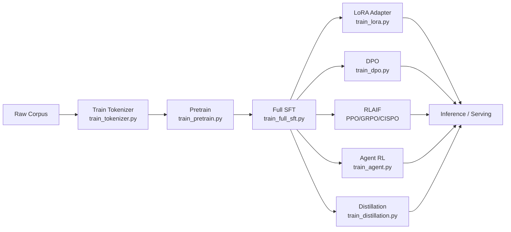

# MiniMind3 技术 Wiki

> 一份从 0 到 1 解读 MiniMind3 的技术文档，覆盖**模型结构、数据管道、训练算法、推理服务**全链路。

MiniMind3 是一个完全从 0 实现的极小语言模型项目，主线 Dense 版本约 64M 参数、MoE 版本约 198M（激活 64M），完整覆盖 LLM 训练全流程。本 Wiki 不是 README 的扩展，而是面向**想真正读懂每一行代码**的研发同学的深度技术解读。

## 📚 文档导航

### 一、项目总览

| 文档 | 内容简介 |
|------|---------|
| [01 - 项目概览](./01-project-overview.md) | 项目定位、核心特性、关键能力清单、模型矩阵 |
| [02 - 项目架构](./02-architecture.md) | 目录结构、模块依赖、训练-推理全景图、数据流 |

### 二、模型与数据

| 文档 | 内容简介 |
|------|---------|
| [03 - 模型架构](./03-model-architecture.md) | `MiniMindConfig`、Dense/MoE 结构、RMSNorm、RoPE+YaRN、GQA、Flash Attention、MoE Router 与负载均衡损失 |
| [04 - Tokenizer 与 Chat Template](./04-tokenizer-and-chat-template.md) | BPE+ByteLevel 分词器、特殊 token、`` 思考块
- **Tool Call**：基于 `<tool_call>` 模板的 OpenAI Function Calling 兼容协议
- **多轮 Agent Rollout**：`train_agent.py` 中实现的多轮 tool-use 强化学习训练框架
- **可插拔 Rollout Engine**：`TorchRolloutEngine` / `SGLangRolloutEngine` 双后端

## 1.3 已发布模型矩阵

| 模型 | 参数量 | 发布时间 | 备注 |
|------|--------|---------|------|
| `minimind-3` | 64M | 2026.04 | 主线 Dense |
| `minimind-3-moe` | 198M / A64M | 2026.04 | 主线 MoE |
| `minimind2-small` | 26M | 2025.04 | 历史版本 |
| `minimind2-moe` | 145M | 2025.04 | 历史版本 |
| `minimind2` | 104M | 2025.04 | 历史版本 |

## 1.4 项目结构总览

```
minimind3/
├── model/              # 模型与 LoRA 实现
├── dataset/            # 数据集与预处理
├── trainer/            # 8 个训练脚本 + 共享工具
├── scripts/            # 推理服务 / Web Demo / 模型转换
├── tests/              # 单元测试
├── docs/               # 本 Wiki
├── eval_llm.py         # 命令行推理与对话
├── requirements.txt    # 依赖锁定
└── README.md           # 项目主文档
```

详细模块依赖与目录解读见 [02 - 项目架构](./02-architecture.md)。

## 1.5 训练全流程一览



每一步的具体实现都对应一份独立的 Wiki 文档，详见 [Wiki 总目录](./README.md)。

## 1.6 关键超参速查

| 配置项 | 默认值 | 来源 |
|--------|-------|------|
| `hidden_size` | 512 / 768 | `MiniMindConfig` |
| `num_hidden_layers` | 8 | `MiniMindConfig` |
| `num_attention_heads` | 8 | `MiniMindConfig` |
| `num_key_value_heads` | 2（GQA） | 训练脚本中显式指定 |
| `vocab_size` | 6400 | `MiniMindConfig` |
| `max_position_embeddings` | 32768 | `MiniMindConfig` |
| `rope_theta` | 1e6 | `MiniMindConfig` |
| `num_experts` | 4 | MoE 专属 |
| `num_experts_per_tok` | 1 | MoE Top-K |
| `router_aux_loss_coef` | 5e-4 | MoE 负载均衡 |
| Pretrain LR | 5e-4 | `train_pretrain.py` |
| SFT LR | 1e-5 | `train_full_sft.py` |
| LoRA LR | 1e-4，rank=16 | `train_lora.py` / `model_lora.py` |
| DPO LR / β | 4e-8 / 0.15 | `train_dpo.py` |
| Distill α / T | 0.5 / 1.5 | `train_distillation.py` |

更详细的参数对比见各阶段对应的 Wiki 文档。
